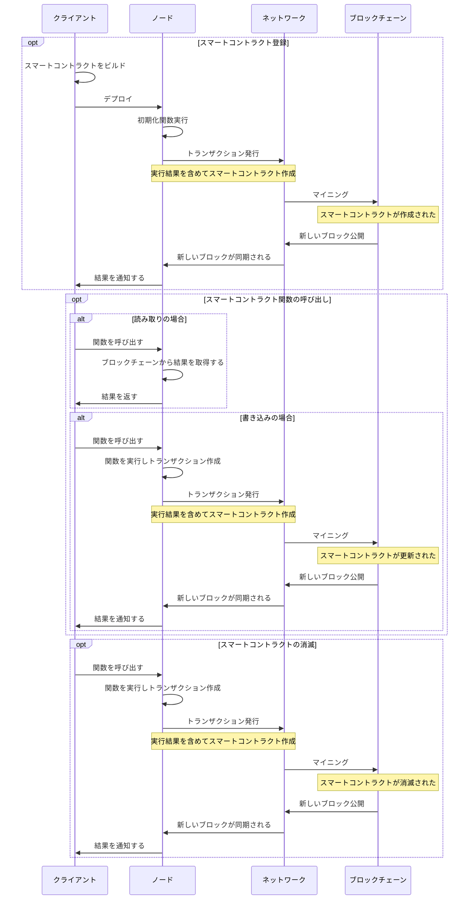

オブジェクト指向のプログラミング言語の場合、クラスのインスタンのライフサイクルは実行するマシンのメモリ上に生成され、他のインスタンスとやり取りして、最後消滅されるが、スマートコントラクトの場合、どうなるかをまとめてみます。

<!--truncate-->

## 登録と消滅
- コントラクト登録のトランザクションが実行される時、コントラクトのコンストラクト関数が実行され、実行後の状態をバイト配列としてブロックチェーンに書き込まれる
- コントラクトの処理の中、`selfdestruct(owner)`を呼び出せば、コントラクトが消滅される
    - コントラクトが消滅された後、コントラクトの関数を呼び出すと異常になる

## コントラクト関数の呼び出し
- 作成されたとしても、どのノードのメモリにも存在せず、単に前回の実行後の状態のバイト配列がブロックチェーンに保持される
- 再度呼び出された時（たとえ関数の呼び出しとか）、ブロックチェーンから前回実行後の状態のバイト配列をノード上にあるEVMにロードされ、実行される
- 終わったら新しい実行後の状態のバイト配列がブロックチェーンにほじされる
- コントラクトが消滅されるまで上記の繰り返し

## 全体のライフサイクル
- シーケンス図でまとめました
- 説明
    - クライアント：web3.jsなど
    - ノード：クライアントが接続している、`geth`などイーサリアムのノードアプリケーション
    - ネットワーク：イーサリアム全体のP2Pネットワーク
    - ブロックチェーン：イーサリアムブロックチェーンデータ

## 参考記事
- [『0005』- 以太坊智能合约生命周期（Ethereum smart contracts lifecycle） · 零基础玩转以太坊Solidity智能合约开发到项目实战](https://solidity.liyuechun.org/0005-yi-tai-fang-zhi-neng-he-yue-sheng-ming-zhou-qi-ff08-ethereum-smart-contracts-lifecycle.html)
