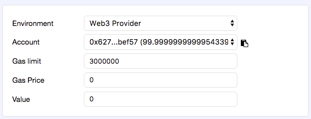
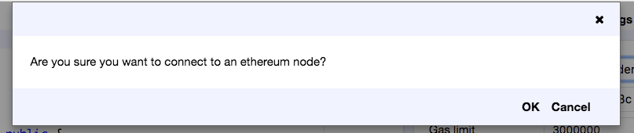
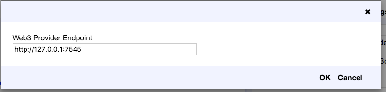
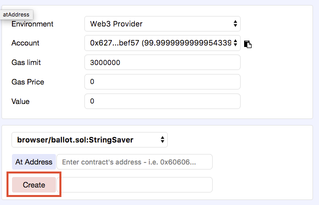
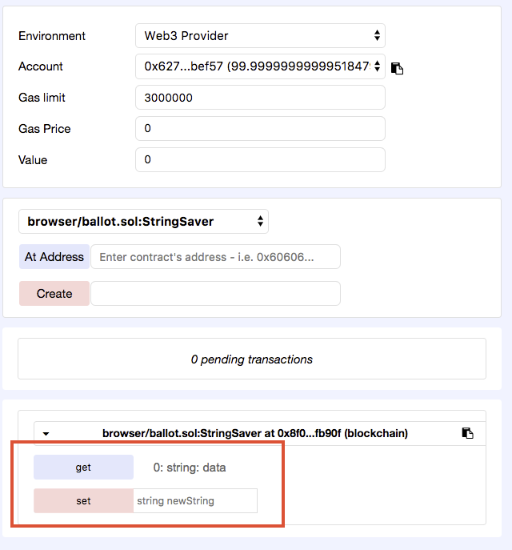
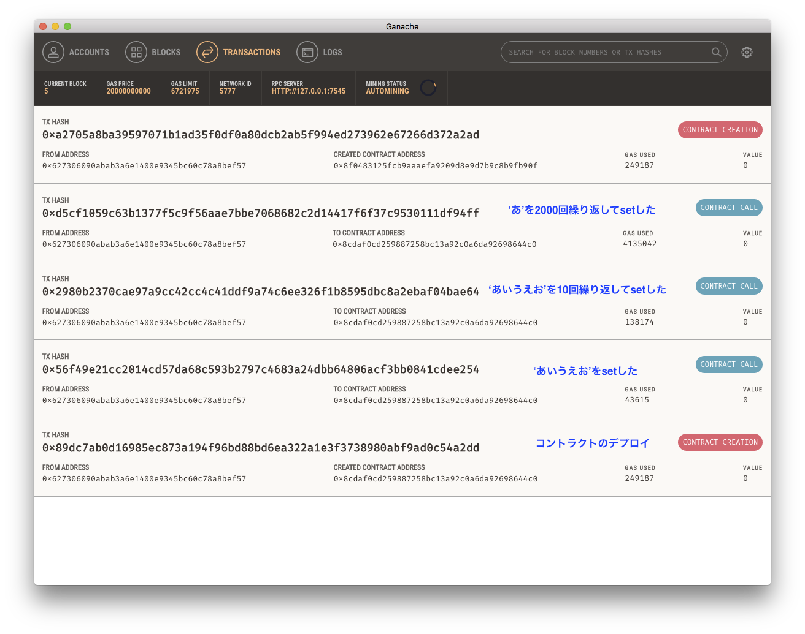
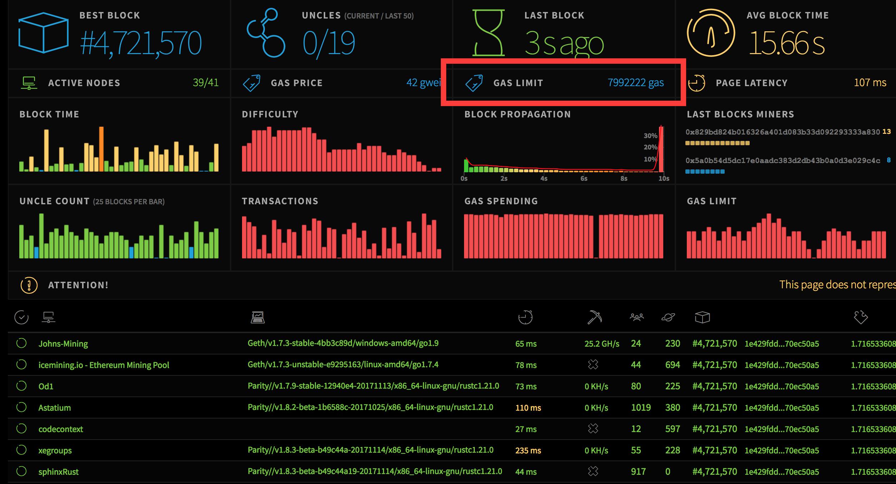

アカウント毎の残高ぐらいは全然良いけど、URLとか、ファイルとか、画像とか、どこまで保存できるかを確認したい


<!--truncate-->

## 環境
- ganache を使って、プライベートネットワークを作る
- browser-solidity アプリでコントラクトを操作する

## 確認したいこと
- 文字列を保存する際、長さの制限はどのぐらい？

```javascript
pragma solidity ^0.4.0;

contract StringSaver {
    string storedData;

    function set(string newString) public {
        storedData = newString;
    }

    function get() public constant returns (string data) {
        return storedData;
    }
}
```

## 手順
- https://ethereum.github.io/browser-solidity/ を使って、上記 ganache で起動しているネットワークに接続する
    - ganache デフォルトは 7545 ポートを起動しているので、browser-solidity の Environment から `Web3 provider` を選択し、Endoint を`127.0.0.1:7545`設定し接続しておく





- 上記コントラクトをbrowser-solidityの編集エリアに入力し、右側の'create'ボタンをクリックし、デプロイする



- プライベートネットワークなので、すぐデプロイされ、下記画像のように関数を操作できるようになります。



- `set`の右側のフィールドに設定したい値を入力して`set`をクリックすれば、`set`関数が呼び出されて、最終的にブロックチェーンに書き込まれる

## 試してみた結果
ganache でトランザクションなどを確認すると下記のようになっています。長い文字列を保存できますが、`gas`は結構かかります。



一番上のトランザクションは関係ないです。

| 文字列            |       gas |
| ----------------- | ---------:|
| 'あいうえお'      |    43,615 |
| 'あいうえお' 10回 |   138,174 |
| 'あ' 2,000回      | 4,135,042 |

`あ`を 10,000 回すると、`out of gas`エラーになりましたが、アカウントの残高が足りなかっただけでした

## まとめ
- 長い文字列などのデータでも保存できますが、その分の gas が掛かるので、今までの普通のシステムのように使うのは、あんまり現実的ではない
- アカウントの残高制限ではなく、トランザクションまたはブロック単位の上限を確認できなかったが、調べてみたら、下記の回答がありました。
    - [gas - Is there a limit for transaction size? - Ethereum Stack Exchange](https://ethereum.stackexchange.com/questions/1106/is-there-a-limit-for-transaction-size/1110#1110)
    - ブロックとトランザクション単位の gas 制限は固定値ではなく、直近のブロックデータによって調整されるのおで、上記記事は 2016/2/7 の時 3,141,592 でしたが、いま時点（2017/12/13 05:13）の https://ethstats.net 確認したら、block gas limit はなんと、**7,992,222** になっています！！！



## 参考記事
- [Ganache で始める Ðapp 開発 · m0t0k1ch1st0ry](https://m0t0k1ch1st0ry.com/blog/2017/12/05/ganache/)
- [Ethereum ＜超初心者の方向け＞Mistを用いたコントラクト開発入門 - ぴんく開発テスト工房](http://pinkworks.hatenablog.com/entry/2017/12/12/004815)
