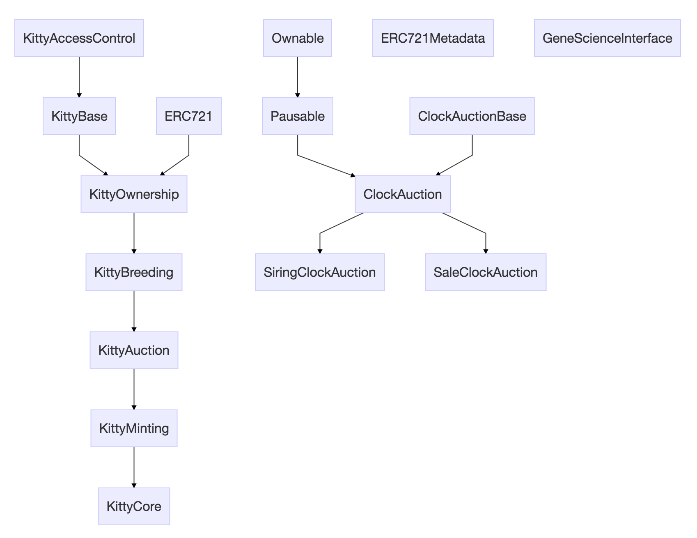

公式的なリポジトリを見つからなかったが、etherscanから直接にコントラクトソースを見えるので、読んでみます。

```javascript
contract Ownable
contract ERC721
contract GeneScienceInterface
contract KittyAccessControl 
contract KittyBase is KittyAccessControl
contract ERC721Metadata 
contract KittyOwnership is KittyBase, ERC721
contract KittyBreeding is KittyOwnership
contract ClockAuctionBase 
contract Pausable is Ownable 
contract ClockAuction is Pausable, ClockAuctionBase
contract SiringClockAuction is ClockAuction
contract SaleClockAuction is ClockAuction 
contract KittyAuction is KittyBreeding
contract KittyMinting is KittyAuction
contract KittyCore is KittyMinting
```
クラス図でまとめるとこんな感じ。



<!--truncate-->

## 気になる箇所
- 全体：クラスを細かく分ける方針で実装されている
- 詳細の読解はこの辺が詳しい[How to Code Your Own CryptoKitties-Style Game on Ethereum](https://medium.com/loom-network/how-to-code-your-own-cryptokitties-style-game-on-ethereum-7c8ac86a4eb3)
- ERC721：トークン１つ１つにユニークであり、別のトークンと交替できないタイプのトークン。この猫とあの猫は、別々の特徴を持っていて、価値も違う。ゲームでよく使われそうな仕組み。
- 猫の外観などの画像は、やはりブロックチェーンに乗ってない。
    - これはおそらく今時のブロックチェーンの課題ですね。あるサービスに必要な内容を全部ブロックチェーンに載せるのはまだ無理な感じ。
    - やはりブロックチェーンの外側で、補完するデータや処理などを持つ必要がある
- 親猫と子猫の遺伝子生成方法は隠されている。よいかどうかは別にして、一応隠せることは証明されたので、活用できそう。
- [x] `GeneScienceInterface`のような、インタフェースみたいなかんじですが、使い方とかはまだ理解できてない。後で調査する　⇒　調べました [仮想仔猫ゲーム CryptoKitties のコントラクト解読その２ - Qiita](https://qiita.com/blueplanet/items/e257450834a5a32f0f10) 


## 参照記事
- [Ethereumブロックチェーン上で仮想仔猫の売買が流行、わずか数日で100万ドル以上の取引が行われた | TechCrunch Japan](http://jp.techcrunch.com/2017/12/04/2017-12-03-people-have-spent-over-1m-buying-virtual-cats-on-the-ethereum-blockchain/)
- フルソースは [etherscan.io](https://etherscan.io/address/0x06012c8cf97bead5deae237070f9587f8e7a266d#code) から参照できる
