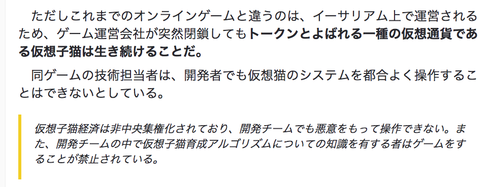

[イーサリアム上で「仮想子猫」育成ゲームが人気、取引の４％占める](https://jp.cointelegraph.com/news/viral-cat-game-responsible-for-huge-portion-of-ethereum-transactions)

上記記事を読んで、誤解している箇所というか、ゲーム運営会社が出した言葉だそうですが、事実と少し相違があるので、共有したい


<!--truncate-->

## 気になる箇所の内容


## 問題点１：仮想仔猫とは？

```
イーサリアム上で運営されるため、ゲーム運営会社が突然閉鎖してもトークンとよばれる一種の仮想通貨である仮想子猫は生き続けることだ。
```

上記の問題は、[仮想仔猫ゲーム CryptoKitties のコントラクトを読んでみる - Qiita](https://qiita.com/blueplanet/items/fa005a1c9457169a7391)　で書きましたが、**猫の外観などの画像は、やはりブロックチェーンに乗ってない。**ところです。
ゲーム運営会社が閉鎖する場合どうなるかというと、仮想仔猫を持っている人は、確かに **トークンとよばれる一種の仮想通貨である仮想子猫**の所有権を持っていますが、それは本当に **トークン** 即ち、**256バイトの乱数みたいな文字列** だけになってしまいます。
理由も上記のまんまで、所有者が持っている256バイトの文字列（トークン）が仮想仔猫の外観とかの特徴を意味していますが、その対応関係は公開されてないし、画像などの外観のデータ自体もブロックチェーンではなく、ゲーム運営会社の Web サーバーに持っているからです。
なので、その**256バイトの文字列が仮想仔猫である**ことではないので、**仮想子猫は生き続ける**とは言えないと思います。

## 問題点２：ブロックチェーンなら操作できない？

```
仮想子猫経済は非中央集権化されており、開発チームでも悪意をもって操作できない。
```

**中央集権ではないので操作できない**と言っていますが、これはどうだろう。
実際のコントラクトは、少なくとも、運営会社側が仮想仔猫を**一時停止（pause）**することができるようになっています。
コードを最後に添付していますが、少し説明すると

- 仮想猫が`ceoAddress`、`cfoAddress`、`cooAddress`という値を持っています
- 上記３つのアドレスであれば、コントラクトの`pause`関数を呼び出すことができます
- `pause`関数が呼び出されると、仮想猫を`paused`状態に設定する
- `paused`状態の仮想猫は下記の各コントラクトで定義していることができなくなる
    - KittyOwnership（所有権制御）
        - transfer
        - approve
        - transferFrom
    - KittyBreeding（仔猫を生まれる処理制御）
        - approveSiring
        - breedWithAuto
        - giveBirth
    - ClockAuction（期間限定オークション制御）
        - createAuction
        - bid
    - KittyAuction（オークション全体）
        - createSaleAuction
        - createSiringAuction
        - bidOnSiringAuction
- 既に明らかですが、運営側は仮想猫を一時停止すると、ほぼ何もできなくなります。

## まとめ
- 個人的に感じるのは、ブロックチェーン自体も発展中なので、サービスを完全にブロックチェーンに載せるのはまだいろいろ課題があって、できてない状態です。
- ブロックチェーンだから操作できないというわけではないです。ブロックチェーン上のコントラクトと言っても、結局プログラムなので、基本的にはデータ修正ぐらいは全然できる。なので、**ブロックチェーン上のデータを編集できない**ということではなく、ブロックチェーン上の**トランザクション履歴（歴史データ）**を編集できない、データ操作は必ず**トランザクション履歴**として保存されるということです。

## 権限制御するコントラクトのコード

```
contract KittyAccessControl {
    // This facet controls access control for CryptoKitties. There are four roles managed here:
    //
    //     - The CEO: The CEO can reassign other roles and change the addresses of our dependent smart
    //         contracts. It is also the only role that can unpause the smart contract. It is initially
    //         set to the address that created the smart contract in the KittyCore constructor.
    //
    //     - The CFO: The CFO can withdraw funds from KittyCore and its auction contracts.
    //
    //     - The COO: The COO can release gen0 kitties to auction, and mint promo cats.
    //
    // It should be noted that these roles are distinct without overlap in their access abilities, the
    // abilities listed for each role above are exhaustive. In particular, while the CEO can assign any
    // address to any role, the CEO address itself doesn't have the ability to act in those roles. This
    // restriction is intentional so that we aren't tempted to use the CEO address frequently out of
    // convenience. The less we use an address, the less likely it is that we somehow compromise the
    // account.

    /// @dev Emited when contract is upgraded - See README.md for updgrade plan
    event ContractUpgrade(address newContract);

    // The addresses of the accounts (or contracts) that can execute actions within each roles.
    address public ceoAddress;
    address public cfoAddress;
    address public cooAddress;

    // @dev Keeps track whether the contract is paused. When that is true, most actions are blocked
    bool public paused = false;

    /// @dev Access modifier for CEO-only functionality
    modifier onlyCEO() {
        require(msg.sender == ceoAddress);
        _;
    }

    /// @dev Access modifier for CFO-only functionality
    modifier onlyCFO() {
        require(msg.sender == cfoAddress);
        _;
    }

    /// @dev Access modifier for COO-only functionality
    modifier onlyCOO() {
        require(msg.sender == cooAddress);
        _;
    }

    modifier onlyCLevel() {
        require(
            msg.sender == cooAddress ||
            msg.sender == ceoAddress ||
            msg.sender == cfoAddress
        );
        _;
    }

    /// @dev Assigns a new address to act as the CEO. Only available to the current CEO.
    /// @param _newCEO The address of the new CEO
    function setCEO(address _newCEO) external onlyCEO {
        require(_newCEO != address(0));

        ceoAddress = _newCEO;
    }

    /// @dev Assigns a new address to act as the CFO. Only available to the current CEO.
    /// @param _newCFO The address of the new CFO
    function setCFO(address _newCFO) external onlyCEO {
        require(_newCFO != address(0));

        cfoAddress = _newCFO;
    }

    /// @dev Assigns a new address to act as the COO. Only available to the current CEO.
    /// @param _newCOO The address of the new COO
    function setCOO(address _newCOO) external onlyCEO {
        require(_newCOO != address(0));

        cooAddress = _newCOO;
    }

    /*** Pausable functionality adapted from OpenZeppelin ***/

    /// @dev Modifier to allow actions only when the contract IS NOT paused
    modifier whenNotPaused() {
        require(!paused);
        _;
    }

    /// @dev Modifier to allow actions only when the contract IS paused
    modifier whenPaused {
        require(paused);
        _;
    }

    /// @dev Called by any "C-level" role to pause the contract. Used only when
    ///  a bug or exploit is detected and we need to limit damage.
    function pause() external onlyCLevel whenNotPaused {
        paused = true;
    }

    /// @dev Unpauses the smart contract. Can only be called by the CEO, since
    ///  one reason we may pause the contract is when CFO or COO accounts are
    ///  compromised.
    /// @notice This is public rather than external so it can be called by
    ///  derived contracts.
    function unpause() public onlyCEO whenPaused {
        // can't unpause if contract was upgraded
        paused = false;
    }
}
