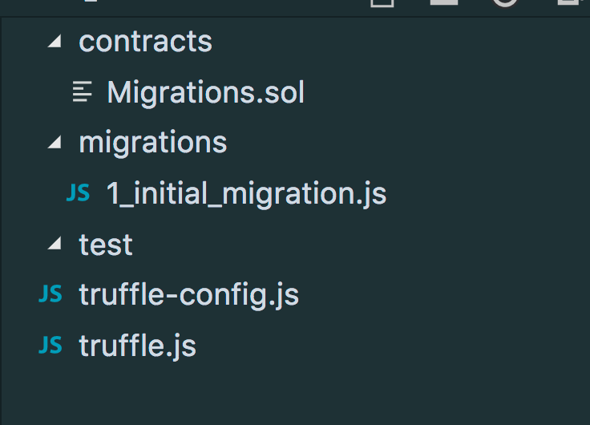

## Truffleとは
- スマートコントラクトの開発・テスト・デプロイ周りのコマンドなどを管理してくれるツールチェーン
- mavenまたはgradleのようにプロジェクト構成などを作成してくれる

<!--truncate-->

## やってみたこと
- プロジェクト作成
    - 下記コマンドで初期化して、初期ファイルを作成してくれます

```bash
mkdir my_token
cd my_token
yarn global add truffle
truffle init
```



**`contracts/Migrations.sol`ファイルはサンプルファイルではなく、マイグレーションを管理するコントラクトである為、削除すると`truffle migrate`が動けなくなってしまう**

- 自分のコントラクト追加
    - `contracts`に`SingleNumRegister.sol`ファイルを追加し、下記内容を追記する

```
pragma solidity ^0.4.17;

contract SingleNumRegister {
    uint storedData;

    function set(uint x) public {
        storedData = x;
    }

    function get() public view returns (uint retVal) {
        return storedData;
    }
}
```

- デプロイ
    - `truffle compile`実行しコントラクトをコンパイルする
    - `truffle develop`でコンソール起動する
    - `migrate`コマンドでマイグレーション実行する

```bash
$ truffle compile
Compiling ./contracts/Migrations.sol...
Compiling ./contracts/SingleNumRegister.sol...
Writing artifacts to ./build/contracts

$ truffle develop
truffle develop                                                                                                                      0|09:17:45Truffle Develop started at http://localhost:9545/

Accounts:
(0) 0x627306090abab3a6e1400e9345bc60c78a8bef57
(1) 0xf17f52151ebef6c7334fad080c5704d77216b732
(2) 0xc5fdf4076b8f3a5357c5e395ab970b5b54098fef
(3) 0x821aea9a577a9b44299b9c15c88cf3087f3b5544
(4) 0x0d1d4e623d10f9fba5db95830f7d3839406c6af2
(5) 0x2932b7a2355d6fecc4b5c0b6bd44cc31df247a2e
(6) 0x2191ef87e392377ec08e7c08eb105ef5448eced5
(7) 0x0f4f2ac550a1b4e2280d04c21cea7ebd822934b5
(8) 0x6330a553fc93768f612722bb8c2ec78ac90b3bbc
(9) 0x5aeda56215b167893e80b4fe645ba6d5bab767de

Mnemonic: candy maple cake sugar pudding cream honey rich smooth crumble sweet treat

truffle(develop)> migrate
Using network 'develop'.

Running migration: 1_initial_migration.js
  Replacing Migrations...
  ... 0xb2f86a092885a3b3f1de6bebec62849e2dec93cf4f68ac58ef94b1a491ec4f58
  Migrations: 0x8cdaf0cd259887258bc13a92c0a6da92698644c0
Saving successful migration to network...
  ... 0xd7bc86d31bee32fa3988f1c1eabce403a1b5d570340a3a9cdba53a472ee8c956
Saving artifacts...
Running migration: 2_single_num_register_migration.js
  Deploying SingleNumRegister...
  ... 0xfb1aa8e153f02d48acd98f7747cbf6f24edbb749289d6d07a825be456335b57e
  SingleNumRegister: 0x345ca3e014aaf5dca488057592ee47305d9b3e10
Saving successful migration to network...
  ... 0xf36163615f41ef7ed8f4a8f192149a0bf633fe1a2398ce001bf44c43dc7bdda0
Saving artifacts...
truffle(develop)>
```

- コントラクトとやり取りしてみる

```javascript
sm = SingleNumRegister.at(SingleNumRegister.address)
// コントラクトのABI情報表示される
...

truffle(develop)> sm.get()
{ [String: '0'] s: 1, e: 0, c: [ 0 ] }
truffle(develop)> sm.get()
{ [String: '0'] s: 1, e: 0, c: [ 0 ] }
truffle(develop)> sm.set(5)
{ tx: '0xa7443bc291fa9072cf3e699be9a9820aaedd2430dbca4d95ebf4882eb65d7fc6',
  receipt:
   { transactionHash: '0xa7443bc291fa9072cf3e699be9a9820aaedd2430dbca4d95ebf4882eb65d7fc6',
     transactionIndex: 0,
     blockHash: '0x1c2bde38ee48aced8041b2d5d6fe327522286953f3be57b4ce36aea39d439c09',
     blockNumber: 5,
     gasUsed: 41642,
     cumulativeGasUsed: 41642,
     contractAddress: null,
     logs: [] },
  logs: [] }
truffle(develop)> sm.get()
{ [String: '5'] s: 1, e: 0, c: [ 5 ] }
truffle(develop)>.exit

// .exit でコンソールを中止する
```

- テスト
    - `truffle test`を実行すれば、テスト実行される
    - truffle のテストはMochaとChainを使ってる

## まとめ
- 一通りコントラクトをデプロイして、やり取りできた
- マイグレーションの実際処理はまだいろいろ分かってないので、もうちょっと調べてみたい
    - これでコントラクトの修正ができ、バージョンアップとかできるようになる？
    - 古いコントラクトは削除される？
    - 新しいコントラクトから古いコントラクトのデータを引き継ぎできる？

## 参考記事
- [ERC-20 Token Standard に準拠した独自トークンを自前実装する - Qiita](https://qiita.com/kyrieleison/items/a5c049097c165cd792bf)
- [【飲食店では世界初】Ethereum上でICO(イニシャルコインオファリング)のコード監査をした話 - Qiita](https://qiita.com/syrohei/items/b6c7f55b66432d38cc59)
