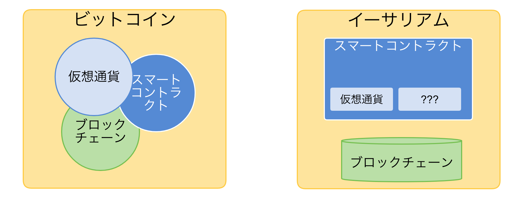

<!--truncate-->

## Rubyist ブロックチェーン始めませんか。

---
## アジェンダー
- ブロックチェーンとは
- 開発モチベーション
- Ruby とブロックチェーン

---
## ブロックチェーンとは

---
## **質問：ビットコインご存知ですか**

---

## ブロックチェーンとは
**ビットコイン**

- 仮想通貨の元祖
- ブロックチェーン上で構築し成功した世界初の仮想通貨
- 今現在既に「通貨」ではなく、「金」となっている感じ

---
## ブロックチェーンとは

ref: https://blockchain-jp.com/guides/4

---
## ブロックチェーンとは
- ビットコインは、ブロックチェーンの最初のアプリケーションにすぎない
- 二世代目のイーサリアムは、改めて設計し直した分散型アプリケーションプラットフォームである

---
## ブロックチェーンとは

---
## 開発モチベーション
- ブロックチェーン自体は発展途中である
- スマートコントラクトは新しい概念である
- ブロックチェーン＋スマートコントラクトは **web 3.0**と言われている

---

## Ruby とブロックチェーン
- イーサリアムのスマートコントラクトの場合、下記の言語で開発できる
    - PythonライクのSerpent言語
    - JavaScriptライクの Solidity 言語
    - LispライクのLLL言語
- Rubyがない！！！

---
## Rubyがない！！！

---
## 作りません？

---
PR
- [[翻訳]どうやってデジタル世界で信頼の自動化を実現できる？ - Qiita](https://qiita.com/blueplanet/items/6ef1af9277c7752fa0cc)
- [一人で「イーサリアム・スマートコントラクト」 Advent Calendar 2017 - Qiita](https://qiita.com/advent-calendar/2017/ethereum-smart-contract)

---
ご清聴ありがとうございました！
