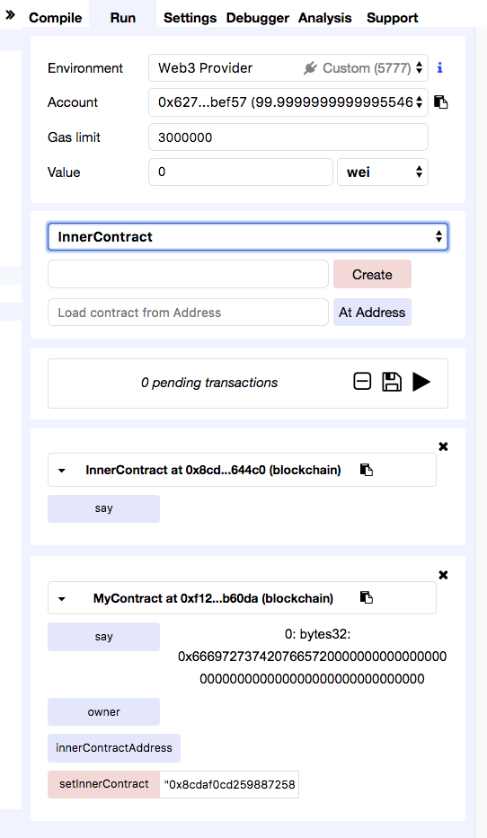
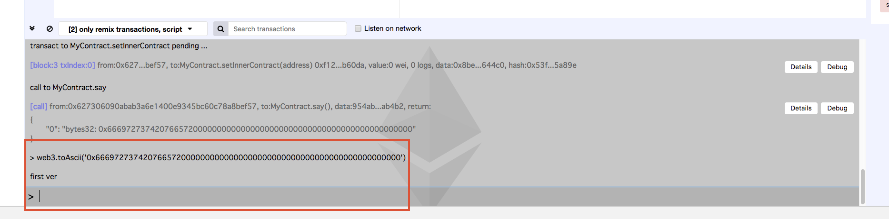
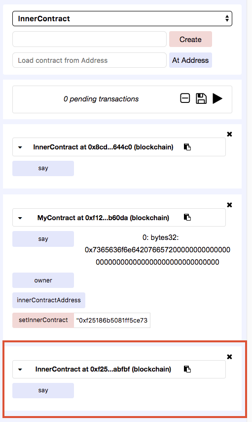

**コントラクトなのに、更新するの？**という問題は一旦おいておいて、ブロックチェーン上で更新できる方法をやってみました。
といっても、[Truffle の Migration は何をやっている？ - Qiita](https://qiita.com/blueplanet/items/e3f5590c9711df4d4845) の応用編的な感じですね。


<!--truncate-->

## コード

```javascript
pragma solidity ^0.4.17;

contract InnerContract {
  function say() public pure returns (bytes32) {
    return "first ver";
  }
}

contract MyContract {
  address public owner;
  address public innerContractAddress;

  modifier onlyOwner() {
    require(msg.sender == owner);
    _;
  }

  function MyContract() public {
    owner = msg.sender;
  }

  function say() public view returns (bytes32) {
    InnerContract innerContract = InnerContract(innerContractAddress);
    return innerContract.say();
  }

  function setInnerContract(address new_address) public onlyOwner {
    innerContractAddress = new_address;
  }
}
```

## 初期バージョンをデプロイする
- 環境準備
    - Ganacheを起動しておく
    - `https://ethereum.github.io/browser-solidity` にアクセスして、`Environment`を`Web 3`選択し、`http://127.0.0.1:7545`に接続しておく
- 初期バージョンデプロイ
    1. 上記ソースをRemixのエディターに貼り付ける
    2. 右側のデプロイ対象コントラクトを`InnerContract`選択し、ピンク色の`Create`ボタンをクリックしデプロイする
    3. 同じく`MyContract`を選択し、デプロイする
    4. デプロイできたら、`InnerContract`のアドレスをコピーして、`MyContract`の`setInnerContract`関数のパラメータとして設定し（ダブルクオーテーションを忘れずに）、`setInnerContract`を呼び出す
    5. 結果確認：`MyContract`の`say`関数を実行する
    6. 添付画像のようによく分からに値が出てくる



- 左側の下の部分をクリックすればコンソール使えるので、そこでデコードしてみたら、ちゃんと`first ver`になっている！！！



## アップデートしてみる
- `InnerContract`の戻り値を`second ver`に変更して、上記と同じく、`InnerContract`を再度デプロイする

```javascript
contract InnerContract {
  function say() public pure returns (bytes32) {
    return "second ver";
  }
}
```



- 上記画像のように、２個目の`InnerContract`が出て来る
- 初期バージョンのデプロイと同じく`InnerContract`のアドレスを`MyContract`の`setInnerContract`経由して設定する
- 再度`MyContract`の`say`関数を呼び出して、同じく値を`web3.toAscii()`でデコードすると、**`second ver`になっている！**

## まとめ
- **エンドユーザ側から見ると、MyContractがアップデートできるようになっています。**
- 入り口のコントラクトを用意して、実処理を裏側のコントラクトに任せることで、コントラクトのアップデートはできる
- もちろん、課題はまだまだいろいろある

## 課題
- [ ] データの移行は [Truffle の Migration は何をやっている？ - Qiita](https://qiita.com/blueplanet/items/e3f5590c9711df4d4845) のように実装すれば行けると思いますが、データ量が多くなると GAS limit すこし不安ですね。もっと良い解決案があるかな。
