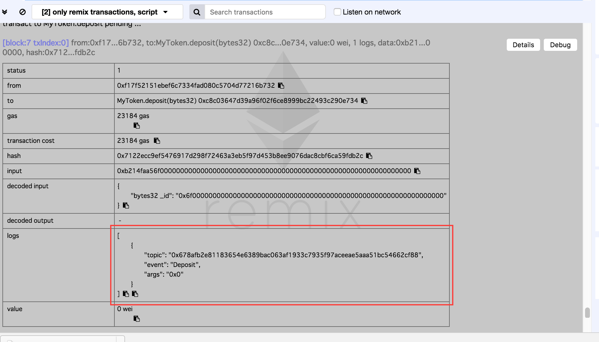
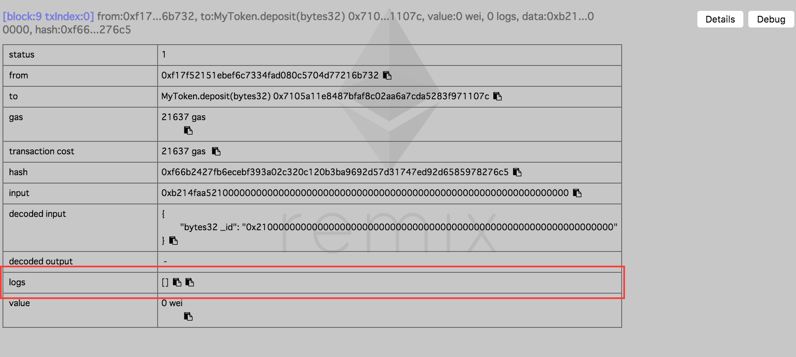

イーサリアムのコントラクトのイベントについて、よく理解できてないので、調べてみました。


<!--truncate-->

## 説明
- イベントは、コントラクト上で発生したことをDAPPなどのクライアントに通知することができる
- イベントが呼び出されると、実際渡された関数のパラメータをトランザクションのログに保持し、コントラクトのアドレスと関連を付けられる。
    - トランザクションがブロックに保持されるので、イベントも同じく、ブロックが存在している限り、イベントのログもずっと存在している
    - ただ、ログとイベントは、コントラクトから（コントラクトの作成者でも）直接にアクセスできない
- イベントのパラメータは `indexed` で定義できる。`indexed`付けると、そのパラメータまたは特定の値に従ってフィルターできる
    - 配列の場合は、`Keccak-256`のハッシュ値で保持される
    - `indexed`ついてないパラメータはログの一部として保持される

## 使ってみる

```javascript
pragma solidity ^0.4.17;

contract MyToken {
    event Deposit(
        address indexed _from,
        bytes32 indexed _id
    );

    function deposit(bytes32 _id) public {
        // deposit pproc
        // log
        Deposit(msg.sender, _id);
    }
}
```

- Ganache起動してから、 Remix を `127.0.0.1:7545`に接続しておく
- 上記内容を Remix に貼り付けて、デプロイする
- 上記内容ですと、`deposit` 関数を呼び出すと、添付画像のように、トランザクションの`logs`項目に、ちゃんとイベント名とパラメータが保持されている



- `Deposit(msg.sender, _id);`をコメントアウトして、コントラクトを再度デプロイし、`deposit` 関数を呼び出すと、下記のように、`logs`項目が空になる



## まとめ
- コントラクトの処理で、ちゃんとログを残したい場合は、イベントを活用しましょう。
