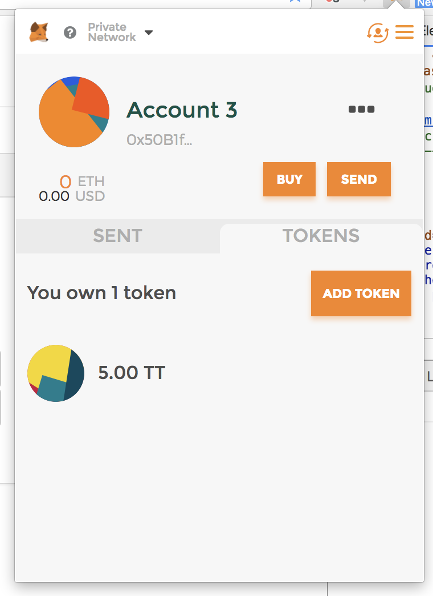

今2017年のスマートコントラクトは、トークンでしたら、普通に億円単位のお金を管理しているので、セキュリティは非常に重要です。そこで出てきたのは、OpenZeppelin。
OpenZeppelinは、Zeppelin Solutionsというスマートコントラクト審査サービスを提供する組織からベストのやり方を整理した内容であり、よく使われる各種スマートコントラクトを実装してオープンソースで公開しているので、それらを継承し拡張すれば、自分のコントラクトを実装できる。

今回は、OpenZeppelinを使ってERC-20トークンを作って、送金したりしてみます。


<!--truncate-->

## フロント側準備
- `npm install -g truffle`でtruffleをインストールしておく
- `truffle unbox tutorialtoken`でテンプレートを生成すると、下記の内容が生成される


- `npm install zeppelin-solidity`でOpenZeppelinの最新バージョンをインストールする

## コントラクトを作る
- 下記内容で`contracts`配下にに`TutorialToken.sol`作成する

```javascript
pragma solidity ^0.4.17;
import 'zeppelin-solidity/contracts/token/StandardToken.sol';

contract TutorialToken is StandardToken {
  string public name = 'TutorialToken';
  string public symbol = 'TT';
  uint public decimals = 2;
  uint public INITIAL_SUPPLY = 15000;

  function TutorialToken() public {
    totalSupply = INITIAL_SUPPLY;
    balances[msg.sender] = INITIAL_SUPPLY;
  }
}
```

- 下記内容で`migrations`配下に`2_deploy_tutorial_token.js`を作成する

```javascript
var TutorialToken = artifacts.require("./TutorialToken.sol");

module.exports = function(deployer) {
  deployer.deploy(TutorialToken);
};
```

- `truffle develop`で開発用チェーンを起動しておく
- `migrate`を実行し、マイグレーションを実行する
- 別のターミナルで`npm run dev`を実行し、開発用webサーバーを起動すると、下記のように設定した残高が表示されるはず。


- Chromeで[MetaMask]( https://chrome.google.com/webstore/detail/metamask/nkbihfbeogaeaoehlefnkodbefgpgknn) をインストールして、接続先を「Custom RPC」選択し接続先アドレスに「http://localhost:9545 」を設定しておく


- 右上にあるユーザマックのアイコンをクリックし、新しいアカウントを作成する


- 新しく作成したアカウントのアドレスをコピーし、画面上のアドレス欄に入れて 500 TT を送信する
    - 成功したらアラートメッセージが出て来る


- MetaMaskで残高を確認してみる
    - アカウントのTokensタブでTTを追加すれば、残高がちゃんと表示される。
    - 画像が **5.00 TT** となっているのは、コントラクトで`uint public decimals = 2`を設定した影響です。




- Token Contract Address は、`migrate`コマンドを実行したときのログから確認できる


## まとめ
- 確認手順が少し多いですが、OpenZeppelinを使うことで、簡単かつセキュアなコントラクトを作成できた
