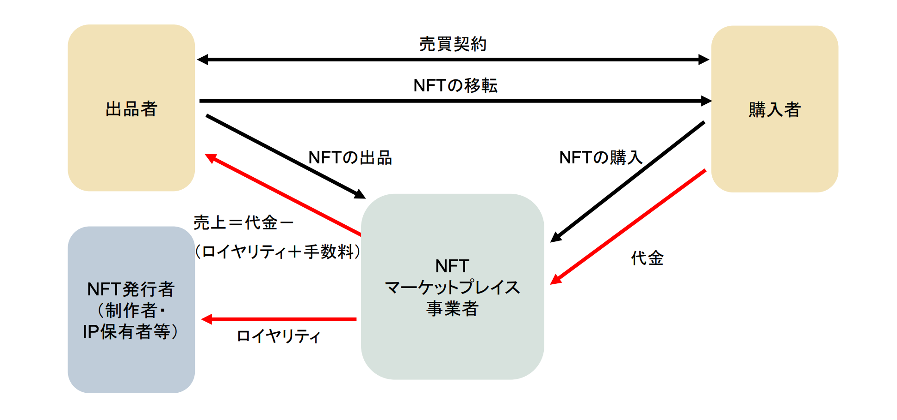

> NFTの凄いところは、販売時点だけでなく、転売時（二次流通時）にも永遠にクリエイターにロイヤリティーが入る仕組みが実装できる

というお話はどこかで聞いたことがあると思いますが、結論からしますと、いろいろ制限されている条件の前提でしか成り立たないことでした。

NFT のスマートコントラクトを実装したことがあればわかると思いますが、ERC 721 / ERC 1155 のスマートコントラクトの標準的な実装に NFT を転送する関数がありますが、そこにロイヤリティ還元するロジックを入れるのは、現実的ではないというか、そもそも転送するタイミングでは取引の価格・ロイヤリティの情報を知る手段がないため実装できません。

なので、結局ロイヤリティの支払いは、opensea のような、取引が発生するマーケットプレイス側の実装次第になっています。

参照元：https://www.caa.go.jp/policies/policy/consumer_policy/caution/internet/assets/internet_committee_220715_08.pdf

<!--truncate-->

## ERC 2981 について
NFT のロイヤリティに関する規格 [ERC 2981](https://eips.ethereum.org/EIPS/eip-2981) がありますが、この規格の内容は強制徴収ではなく、ただ単に いくら還元すべきかの情報を提供する手段でした。

> Simple Summary
 A standardized way to retrieve royalty payment information for non-fungible tokens (NFTs) to enable universal support for royalty payments across all NFT marketplaces and ecosystem participants.

また、規格の設計上は、考えられるロイヤリティの受取人への支払い方法を完全に対応するのが不可能であるため、シンプルにロイヤリティの受け取るアドレスは、１つしか設定できません。

## opensea の動向
もともとは ERC 2981 サポートしておらず、 opensea サービス上の独自の設定値（コントラクトの所有者がその値を設定できる）に従って、ロイヤリティを還元するようになっていました。

2022 年 11 月の最新方針が発表されました。

- ロイヤリティを強制還元するオンチェーンツールを公開
    - https://github.com/ProjectOpenSea/operator-filter-registry
    - 上記コードには他のロイヤリティをスキップするマーケットプレイスへの移転を禁止する処理がある
    - 既存の発行済の NFT はコードを入れなくてもロイヤリティを還元し続ける
- これから新しくデプロイされるコントラクトは、上記コードを導入しないと ロイヤリティを還元しない

## まとめ
NFT が転売時にも永遠にクリエイターにロイヤリティ還元されるとの神話がありましたが、現実は意外に厳しいです
