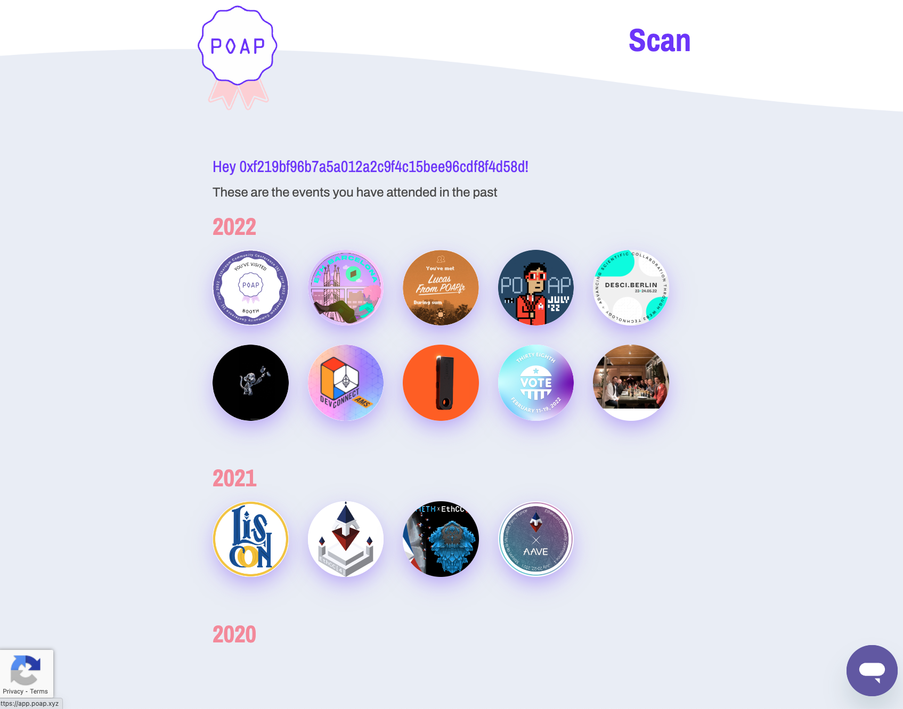

[SBT：譲渡不可 NFT の紹介](https://qiita.com/blueplanet/items/23385c773ee0759ad821) で説明した vitalik の Soulbound タイトルの記事にも出ていて、`proof of attendance protocol` 出席証明プロトコルの略語であり、ズバリ「参加証明バッチ」です。
EIP ではなく普通に[１つのサービス](https://poap.xyz/) の実装になっています。

<!--truncate-->

## 使い方
[poap.xyz](https://poap.xyz/) サービスの内容としては、
- イベント主催側はイベントを登録してイベントを公開する
- 参加側はイベントページに行って、NFT を mint する
- もらった NFT はサイト上で確認できて、もちろん自分のウォレットでも確認できる

のようになっています。

## 実装詳細

スマートコントラクトは下記で確認できます。

- 入り口コントラクト：https://etherscan.io/token/0x22c1f6050e56d2876009903609a2cc3fef83b415
- トークンのコントラクト：https://etherscan.io/address/0x4e90495f66fb04a5fba401967abd607e2ea0ab46#code

SBT の実装かと思いましたが、そうではなく、ERC 721 を拡張したトークンでした。
なので、現状は、[poap.xyz](https://poap.xyz/) のトークンは、イベントの参加証明 NFT として実装されて転送可能になっています。

## 他の応用
- [Adidas の POAP](https://poap.gallery/event/14195)
    - Adidas は、2021 年ローンチしたショッピングアプリ CONFIRMED にて、POAP を配布しました
- [NFTを活用したスキルや仕事の実績証明サービス「Job POAP」](https://jobpoap.xyz/)
- [自由民主党NFT発行にHAZAMA BASEを採用！5月28、29日開催の青年局会議・研修会で政策コンテスト表彰者や研修会出席者に譲渡不能のNFT・POAPを配布](https://prtimes.jp/main/html/rd/p/000000014.000020554.html)

## まとめ
参加証明バッチで何ができるの？との疑問があるかもしれませんが、逆に感じたのは、オンチェーン上の履歴はどんどん現実世界と繋がって行くと感じました。
