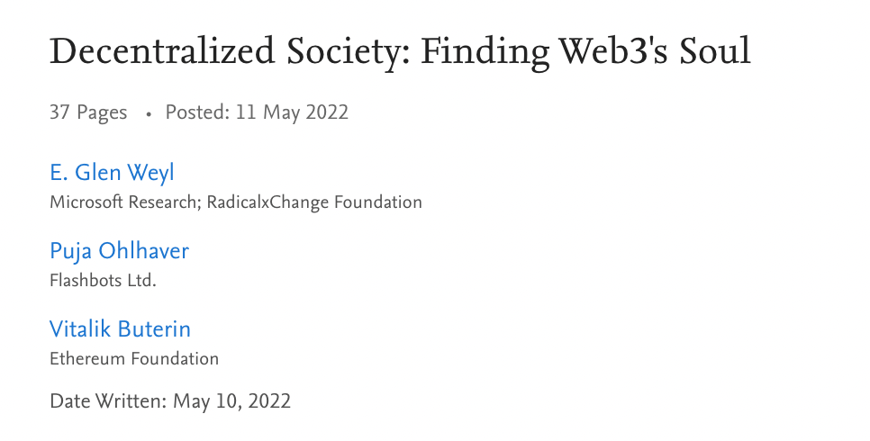
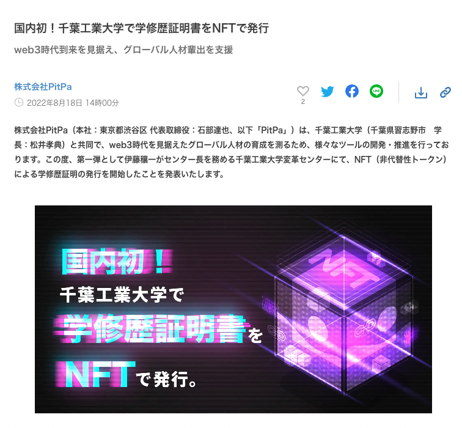

譲渡不可 NFT については、[NTT](/blog/2022/12/04/ntt) を紹介しましたが、今年話題になっているもう１つ `SBT` があります。SBT とは、 `SoulBound Token` の略語であり、Vitalik の提案から広がっています。

名前の由来は、人気オンラインゲーム「World of Warcraff」からアイデアを得ています。
そのゲームの道具アイテムには、任意で他人に譲ったり売ったりものはもちろんありますが、もう１つの種類として、一度拾うと他人に譲ったり売ったりすることができないアイテムがあり、ゲームの中では `魂に紐付けいたアイテム（SoulBound Item）` と呼ばれています。Vitalik はこの発想をブロックチェーンに持ってきた経緯です。

<!--truncate-->

## 最初は vitalik のブログ記事でした
- 2022 年 1 月 26 日、vitalik が、[Soulbound](https://vitalik.ca/general/2022/01/26/soulbound.html) タイトルの記事を発表しました。
- ゲームの soulbound アイテムのお話しからはじめ、譲渡不可な NFT・譲渡不可なガバナンス権利の可能性を言及しました。

## 論文発表
- 2022 年 5 月 11 日、[Decentralized Society: Finding Web3's Soul](https://papers.ssrn.com/sol3/papers.cfm?abstract_id=4105763) 論文を他の二方と発表しました。SBT で分散型社会を構築する構想になります。
- 詳細の実装のお話はないですが、それなりのボリュームがあるので、[いろいろ議論されています。](https://papers.ssrn.com/sol3/papers.cfm?abstract_id=4105763)
  - 

- それ以来はいろいろ議論されて注目されています

https://twitter.com/AkioHoshi/status/1528330197342117888?s=20&t=AnDRXdrEcZdNMhC8kS7Y5g

https://www.xross-dx.com/article/aboutSBT-byGG-vol1.html

https://www.sbbit.jp/article/fj/93134

https://note.com/shinkinjo/n/nd968502eee99

https://coinpost.jp/?p=353189

## 実装について
SBT は、現状まだ決めた EIP がなく、[NTT：譲渡不可の NFT の紹介](https://qiita.com/blueplanet/items/89c9af6bf0ad836d9272) 記事で紹介した NTT や下記の EIP があります。

No |作成日付|ステータス|内容
---|---|---|---
[EIP 4973 (Account Bound Token)](https://eips.ethereum.org/EIPS/eip-4973)|2022-04-01|Review|転送のための標準的なインタフェースを実装していない。このEIPは、ABTの造成、割り当て、取り消し、追跡のための基本的な機能を定義しています。
[EIP 4974 (Experience Token Standard)](https://eips.ethereum.org/EIPS/eip-4974)|2022-04-02|Draft|ビデオゲームの経験値、学術論文の引用、Redditのカルマのように、有用な貢献に対して与えられ、区別できない単位で蓄積され、権限を与えられた信頼できる当局によってのみ再割り当てまたは破棄されるべきポイントのようなもの
[EIP 5114 (Soulbound Token)](https://eips.ethereum.org/EIPS/eip-5114)|2022-05-30|Draft| mint 時に他の NFT と結合し、その後譲渡/移動ができないトークン
[EIP 5192 (Minimal Soulbound NFTs)](https://eips.ethereum.org/EIPS/eip-5192)|2022-07-01|Final|ERC721 を拡張して、トークンをソウルバウンドさせるための最小限のインタフェースを提案し単一のアカウントにバインドされた非可溶性トークンである
[EIP-5516: Soulbound Multi-owner Tokens](https://eips.ethereum.org/EIPS/eip-5516)|2022-08-19|Review|これまでのアカウントバインドトークン標準は、ユーザーがアカウントキーを紛失したり、回転させたりすることで、その過程でトークンを紛失するという問題に直面している。このEIPは、この問題に対して、SBTのリサイクルを可能にする解決策を提供する

## 事例
2022年8月18日、千葉工業大学で学修歴証明書をNFTで発行と発表されました。
Soulbound トークンに通じる譲渡不可な NFT となっています。

## まとめ
ブロックチェーンは、ビットコイン・暗号化通貨のおかげでよく知られるようになってきたと同時に、金臭いと感じられてしまっています。取引を目的とするものではなく、分散型社会を構築するためにブロックチェーンを活用する SBT はすごく期待できると思います。
