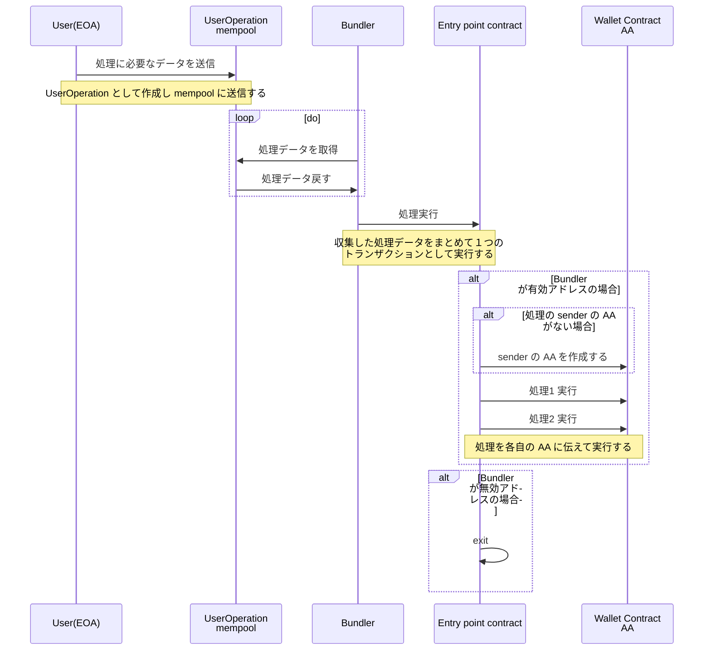

Ethereum のアカウントが下記２種類があるのは既に知られていると思います。
- EOA：外部所有アカウント、つまり人間がプライベートキーで制御して使うアカウント
- CA：コントラクトアカウント、スマートコントラクトをデプロイしてできたアカウント。プライベートキーなし

また、現状はプロトコル上、トランザクションは EOA による電子署名したものである前提になっている為、すべてのトランザクションが EOA からトリガーさせて実行していて、CA からはトリガーできません。

せっかく CA でいろいろ自動化できているので、この差をなくして EOA なしでもっとコントラクトウォレットを利用したいことが結構初期段階から考えられています。
また、 EOA の場合プライベートキーでフルコントロールできるため、セキュリティ向上は重要な課題であり、常に問題視されています。
これらを解決するために、EOA ではなく、CA を活用しよりセキュアなウォレットを実現したいのが、Account Abstraction （AA）になります。

他の EIP もありますが、新しいトランザクションタイプの追加や新しい opcode の追加のようなプロトコルレイヤーの修正が必要なので、あんまり進められていませんでした。ERC4337 は、それらの修正の必要ない新しい考案であるため注目されています。

ERC4337 の設計は、メタトランザクションを参考して実現しています。参考記事が詳細があるので、ここはシーケンス図を載せておきます。

<!--truncate-->

## ERC 4337 のシーケンス図
想定しているロールは下記あります
- 処理を実行したいユーザー
- 処理を実行できる AA
- 処理情報を収集・トリガーさせる Bundler
- 処理情報に従って AA に対して処理を実行させる エントリーポイントコントラクト

## 参考リンク
- [ERC 4337: account abstraction without Ethereum protocol changes @Vitalik]
- [AA（Account Abstraction）の先にある、コントラクトウォレット中心の世界](https://zenn.dev/sivira/articles/d041f1ac44ca1e#%E9%96%A2%E9%80%A3%E8%B3%87%E6%96%99%EF%BC%882022.07.13%2C-2022.08.30-%E8%BF%BD%E8%A8%98%EF%BC%89)

## まとめ
プライベートキー１つでフルコントロールできてしまう EOA は、セキュリティ周りの課題と使いにくい課題（覚えにくい）は問題視されています。web3 の入り口としてのウォレットはずっとこれらを解決したいと模索しています。
ERC4337 の AA は、プロトコルレイヤーの修正なしでウォレットを改善できるように見えるので、結構期待しています。
