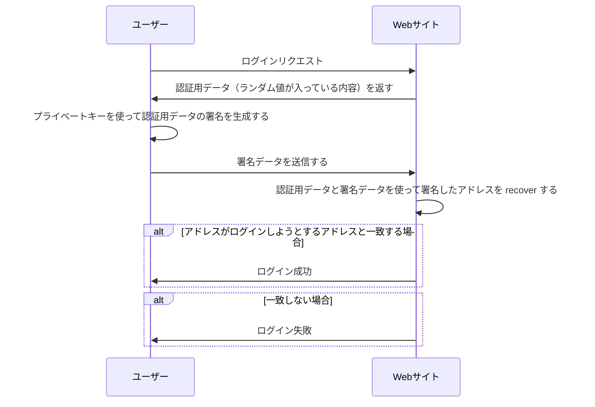

公開鍵技術は、web 2.0 でもいろいろ使われていながらも、web 3.0 の基本構成の技術の１つではあります。

<!--truncate-->

## 公開鍵技術とは
公開鍵技術とは、暗号化や電子署名などの情報セキュリティにおいて、パブリックキーとプライベートキーを二つ持つ技術です。
- パブリックキーは公開され誰でも利用できる
- プライベートキーは秘密にされ、キーの持ち主だけが利用できる

特徴の１つは `暗号化と復号化が異なる鍵を使う` ことです。パブリックキーで暗号化した内容は、プライベートキーでしか復号化できません。秘密のメッセージを送信したいケースで例をあげますと、

- 送信者が送信先の `パブリックキー` を使って送信内容を暗号化して送信する
- 受信側は `プライベートキー` を使って復号してメッセージを確認できる

流れになります。この送信内容は公開されても、`プライベートキー` を持たない限りでは復号化できません。

もう1つの特徴としては、`プライベートキー` で署名したデータに対して、`そのパブリックキーでの署名であるかどうかを検証できる` ことです。
例をあげますと

- 検証者は、特定の内容を署名者に送信する
- 署名者は、`プライベートキー` でその内容の署名を生成して返す
- 検証者は、`元の内容` + `署名者のパブリックキー` を使って `署名した内容` は正しいかどうかを検証できる
    - ここでいう `正しい` というのは、 `指定した署名者のプライベートキーで署名した` ということです。

この2番めの特徴は、認証としても使えるので、その流れを説明します

## 公開鍵での認証方式
イーサリアムの場合は、 [web3.eth.accounts.recover](https://web3js.readthedocs.io/en/v1.2.11/web3-eth-accounts.html#recover) 関数を使って、元データと署名を渡せば、その署名で使っているアドレスが返されるので、よりカンタンに検証できます。

面白いところは、このフローでは、web サイト側はユーザーのパスワードやプライベートキーなどの秘密情報を一切持っていません。
ユーザーがログインしようとする際、「0xab...f というアカウント（アドレス）です。これでログインしたい」の時、web サイトとして「このユーザーが本当に 0xaa...f のアカウントの持ち主であるかどうか」を検証できればよい。web サイト側が推測不可能な認証用データ（署名する元データ）を用意すれば、後は署名データを使って、本当に 0xaa...f のアドレスで署名したかどうかを検証すれば済みます。

## EIP 4361
まだレビュー中ですが、この仕組を適用する EIP もありました。

https://github.com/ethereum/EIPs/blob/master/EIPS/eip-4361.md

## まとめ
公開鍵技術は、非対称暗号化技術である為、この「非対称性」をうまく使えば、もっと活用できそうですね。
