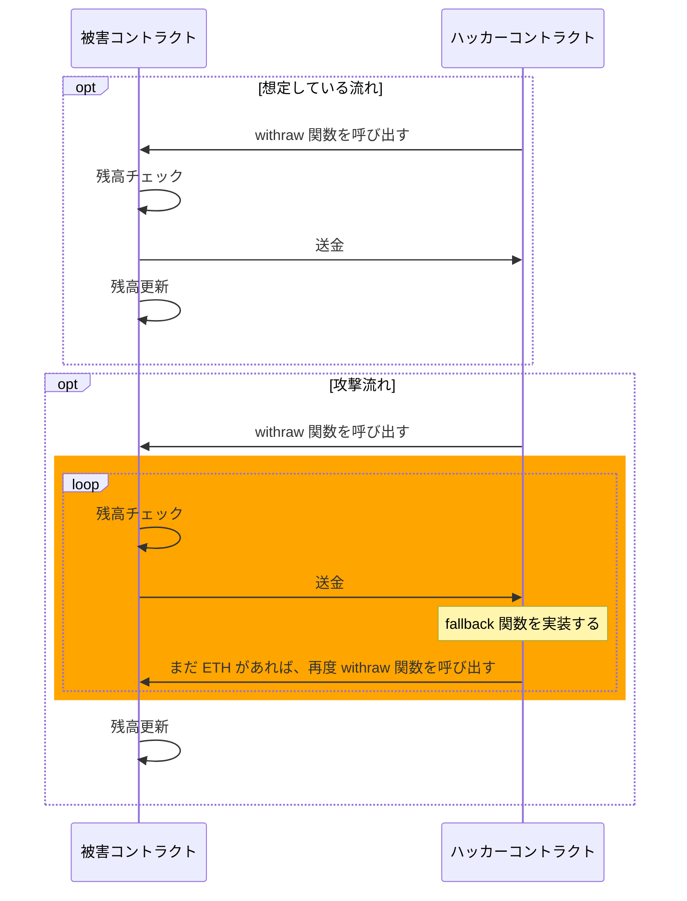

スマートコントラクトで実装する web3.0 アプリケーションは、公開・透明を実現する為ほとんどオープンソースしているので、資産を持っている上に全ての処理を公開していて、非常時攻撃されやすい状況になっています。
よって、web3.0 アプリケーションにとっては、スマートコントラクトのセキュリティは一番重要なことと言っても過言ではありません。

本記事では、初心者向けに、Re-Entrancy 攻撃と対応方法を紹介します。


<!--truncate-->

## Re-Entrancy 攻撃とは
Re-Entrancy 攻撃とは、攻撃者がスマートコントラクトの処理を呼び出す際に、特別な仕組みを利用しコントラクトを繰り返し実行する手法です。処理が繰り返されるため、コントラクトは開発者が想定していない動きになり正しく実行されず、攻撃者が不正な利益を得る可能性があります。

ここで言う特別な仕組みというのは、イーサリアムのスマートコントラクトが自分に対して送金される際に処理を実装できる fallback 関数です。

> fallback 関数は他のトリガーもありますが、本記事は割愛します。



上の流れは開発者が想定している流れですが、オレンジの部分は、ハッカーコントラクトに fallback 関数を実装して、その中でまた被害コントラクトの withraw 関数を呼び出すことで、被害コントラクトが開発者想定外の処理になってしまいました。

**下記コードは理解しやすくするため、上記説明の部分のみ掲載しています。**

```solidity
// 被害コントラクト
pragma solidity ^0.8.17;

  contract Dao {
    mapping(address => uint256) public balances;

    ...

    function withdraw() public {
      uint256 balance = balances[msg.sender];
      require(balance > 0, "Insufficient funds.  Cannot withdraw")

      msg.sender.call{value: balance}("");
      balances[msg.sender] = 0;
    }

    ...
  }
}

// ハッカーコントラクト
pragma solidity ^0.8.17;

interface IDao {
  function withdraw() external ;
 }

contract Hacker {
  IDao dao; 

  constructor(address _dao){
    dao = IDao(_dao);
  }

  function attack() public {
    dao.withdraw();
  }

  fallback() external payable{
    if(address(dao).balance >= 1 ether){
      dao.withdraw();
    }
  }
}
```

## 対応方法
いくつありますが、よく使われる２つを紹介します。

## 処理ロックをかける
出金処理にロックをかけることで、ロックしている間は、再度実行されるとエラーにさせる方法です。

```solidity
// 被害コントラクト
pragma solidity ^0.8.17;
  contract Dao {
    bool internal locked;
    mapping(address => uint256) public balances;

    // modifier を追加してロックをかける
    modifier noLock() {
      require(!locked, "No reentrancy");
      locked = true;
      _;
      locked = false;
    }

    ...

    function withdraw() public noLock {
      uint256 balance = balances[msg.sender];
      require(balance > 0, "Insufficient funds.  Cannot withdraw")

      msg.sender.call{value: balance}("");
      balances[msg.sender] = 0;
    }

    ...
  }
}
```

## Checks-Effects-Interactions パターンを使う
Checks-Effects-Interactions パターンとは、`チェック・変更・連携` （個人的な訳）の順番で実装するパターンです。
上記で説明しますと、 `残高チェック -> 残高変更 -> 送金` 順番にするということです。
下記コードは、最後の２行の順番を入れ替えただけです。

```solidity
function withdraw() public noLock {
  uint256 balance = balances[msg.sender];
  require(balance > 0, "Insufficient funds.  Cannot withdraw")

  balances[msg.sender] = 0;
  msg.sender.call{value: balance}("");
}
```

## まとめ
シンプルなサンプルで Re-Entrancy 攻撃の内容と対応方法を紹介しました。
セキュアなスマートコントラクトを書きましょう。
