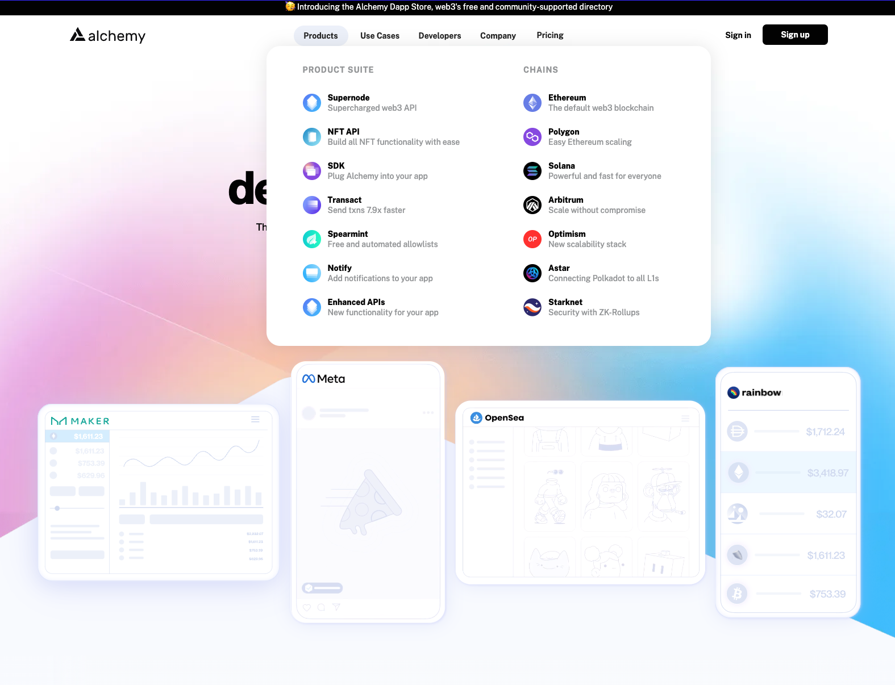

web3.0 アプリケーションを開発するとブロックチェーンの RPC サーバーが必要になりますが、自分で用意せずに他のサービスを使う場面も多々あります。

[infura.io](https://www.infura.io/) は老舗ですが、後続のサービスとして、[alchemy](https://www.alchemy.com/) も有力な選択肢になってきています。また、基本のブロックチェーン RPC サーバー以外、他の便利な API が提供されていて、かつ SDK も提供されているので、詳細内容を紹介します。




<!--truncate-->

## サポートしているチェーンの比較

|chain|alchemy|infra.io|
|-----|:-------:|:--------:|
|Ethereum|◯|◯|
|Polygon|◯|◯|
|Solana|◯|◯|
|Arbitrum|◯|◯|
|Optimism|◯|◯|
|Astr|◯|☓|
|Starknet|◯|◯|
|Celo|☓|◯|
|Avalanche C-Chain|☓|◯|
|Palm|☓|◯|
|Near|☓|◯|

## 他の便利な API

## [NFT API](https://docs.alchemy.com/reference/nft-api-quickstart)
NFT のデータを取得したことがあればお分かりだと思いますが、１つのアドレスに対してい、所有しているすべての NFT を出したい場合は、実は結構面倒で、必要に応じて各 NFT コントラクトのアドレスを収集したりする必要があります。
Alchemy の SDK を使えば、その手間もかけずにカンタンにできてます。

下記は公式サイトのサンプルから、読みやすくするためコメントや console.log をいくつ削除しただけですが、これだけでそのアカウントが所有するすべての NFT を表示できますね。

```js
import { Network, Alchemy } from "alchemy-sdk";

const settings = {
  apiKey: "demo", // Replace with your Alchemy API Key.
  network: Network.ETH_MAINNET, // Replace with your network.
};
const alchemy = new Alchemy(settings);

const nftsForOwner = await alchemy.nft.getNftsForOwner("0xshah.eth");
console.log("number of NFTs found:", nftsForOwner.totalCount);

for (const nft of nftsForOwner.ownedNfts) {
  console.log("contract address:", nft.contract.address);
  console.log("token ID:", nft.tokenId);
}

const response = await alchemy.nft.getNftMetadata(
  "0x5180db8F5c931aaE63c74266b211F580155ecac8",
  "1590"
);

// Print some commonly used fields:
console.log("NFT name: ", response.title);
console.log("token type: ", response.tokenType);
console.log("tokenUri: ", response.tokenUri.gateway);
console.log("image url: ", response.rawMetadata.image);
console.log("time last updated: ", response.timeLastUpdated);
```

## [Notify](https://docs.alchemy.com/reference/notify-api-quickstart)
ブロックチェーン上に発生するイベントを webhook 方式で通知してくれるサービスです。

サポートされているイベントタイプは下記になっています。

Webhook Type | Description | Network
-- | -- | --
Mined Transaction | 送信したトランザクションがブロックに含められたタイミング | All
Dropped Transactions | 送信したトランザクションが削除されたタイミング | All
Address Activity | すべての ETH、ERC20、ERC721、ERC1155 の送受信発生したタイミング | All
NFT Activity | Ethereum NFT の ERC721 および ERC1155 の NFT が転送されたタイミング| Ethereum Mainnet & Goerli
NFT Meta Updates | Ethereum および Polygon NFT の ERC721 および ERC1155 トークンコントラクトのメタデータの更新されたタイミング | Ethereum Mainnet & Goerli; Polygon Mainnet & Mumbai

これらの通知を活用すれば、もっとリアルタイムでユーザーに情報変更を通知できますね。

## まとめ
上記２つを紹介しましたが、それ以外の API もあるので、ぜひ試してください。
