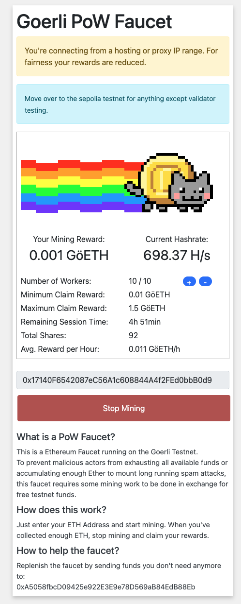

イーサリアム 2.0 の The Merge 実施できて PoS に切り替えたので、テストネット Ropsten / Rinkeby / Kiln がシャットダウンして、今後は、テストネットは Goerli と Sepolia が稼働するためこちらを使いましょうと発表されました。

https://blog.ethereum.org/2022/06/21/testnet-deprecation

本記事では、Goerli テストネットの ETH 入手方法を紹介します。

<!--truncate-->

## SNS 共有リンクでもらう
https://goerli-faucet.mudit.blog/

Twitter または Facebook でイーサリアムのアドレスをポストして、その発言のリンクを入力することで ETH もらえます。

## alchemy 運営の faucnet サイト

https://goerlifaucet.com/

アドレス入力するだけでよいが、一日１回の制限で 0.2 Goerli ETH もらえます

## PoW マイニングでもらう
https://goerli-faucet.pk910.de/

PoS のバリデーターの動作検証は 32 ETH 必要なので、もともと discord でボットにコマンド投げれば 32 ETH もらえましたが、悪用を防止するため、こちらに切り替えたようです。
アドレスを入力すればよいが、本当にマイニング処理実行されるので、それなりに CPU の負荷がかかります。

いくつ注意点があります

- CPU でマイニングする処理実行するので、それなりに負荷がかかります
    - マシンのスペックによって最大数が異なりますが、実行するワーカー数は調整できます
- １回開始すると、最大５時間までマイニングできます
    - 途中で停止するのもできます
    - そこまでの ETH を自分のアドレスに送金できます
- マイニング終わってから、手動操作で自分のアドレスに送金する必要があります
    - さらに、期限が設けられて、期限すぎると、送金できなくなるので、忘れずに送金しましょう
- もらう ETH 数ですが、**マイニング** なので、競争ゲームであり、参加している全員の計算力と自分が使っている計算力次第です
    - 画面上に予想最大値を表示してくれるので、参考できます
    - 余談ですが、原因分からないですが、平日は添付画像のように 1.5 ぐらいですが、週末の場合、5 ぐらいだったりします

## まとめ
PoS のバリデーターの検証をやりたいなら、PoW のマイニングのほうが良さそうですね。
