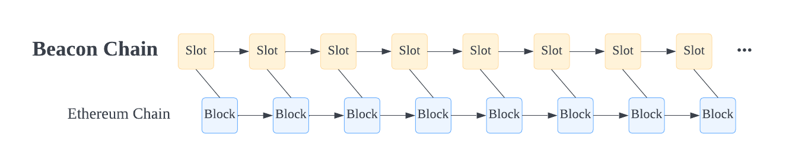
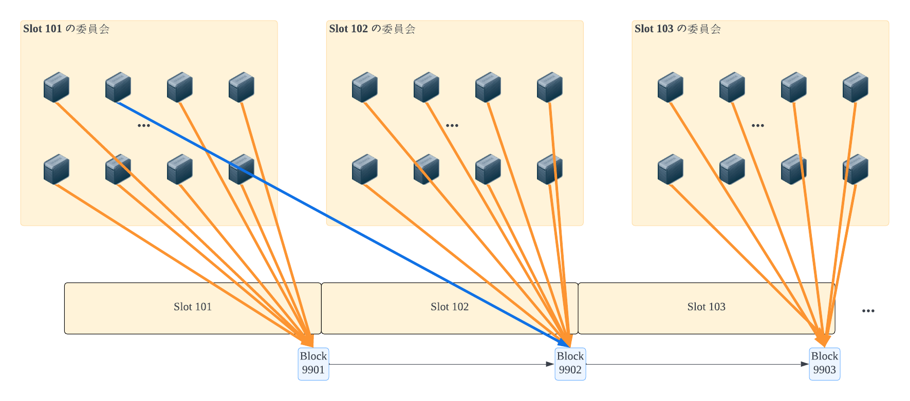

The Merge が実施され、イーサリアムは順調に 2.0 に進んでいます。
コンセンサスアルゴリズムが PoS に切り替え、シャーディングも実装されるため、1.0 よりアーキテクチャが複雑になってきたので、整理してみました。

**2022 年 12 月では、シャーディングまだ実装できていません**

<!--truncate-->

## チェーンレベル

イーサリアム 1.0 は１つのチェーンでしたが、2.0 は、複数のチェーンから構成されます。

- ビーコンチェーン（Beacon Chain）：コンセンサスレイヤー
    - コンセンサスの為に、シャードチェーンの次のブロックに対する投票を収集・検証などの処理を実行します。
- シャードチェーン（Shard Chain）：現時点では Etheeum Chain １個しかないですが、今後シャーディングの実装ができていれば、複数（現在の設計では最大 64 個）できる
    - トランザクション（スマートコントラクトの関数呼び出しなど）は、シャードチェーンで実行します。

ブロック生成の詳細を知りたい場合、[Ethereum 2.0: PoS の新しいブロック生成流れを整理してみた](https://qiita.com/blueplanet/items/58839a15e721df7e6175) ご参照ください。

## ネットワークレベル

ネットワークには、ビーコンチェーンとシャードチェーンのクライアントを実行するサーバーがあります

- ビーコンチェーンのクライアントを実行するサーバーは、バリデーターサーバー
- シャードチェーンのクライアントを実行するサーバーは、今までのイーサリアム 1.0 の RPC サーバー

になります。
- 詳細の流れは [Ethereum 2.0: PoS の新しいブロック生成流れを整理してみた](https://qiita.com/blueplanet/items/58839a15e721df7e6175) に書いていますが、バリデータサーバーは、スロット単位の委員会に割り振られて、そのスレットに対して、シャードチェーンのどのブロックが正しいかを投票します
- オレンジ色は正常な正しい投票ですが、青色のような間違った投票があったり、Slot 102 と Slot 103 の委員会の中、投票を収集できなかったりすることもありえます。
    - 間違った投票を行ったり、投票しなかったりなど、「ちゃんと仕事していない」、または、「悪意な行為をした」などの場合は、内容に応じて罰則も設けられています。別途記事にまとめる予定です。

## まとめ
イーサリアム 2.0 は、ビーコンチェーンを設けて、コンセンサスレイヤーとトランザクション実行レイヤーを分けることで、シャーディングの為のアーキテクチャができました。
