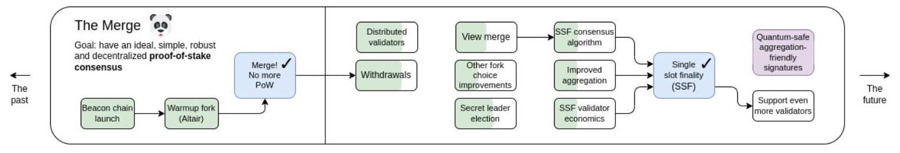

2022年9月15日15時ごろ、イーサリアムの大型アップグレード The Merge が完了しました。
The Merge は、イーサリアムエコシステムに対して非常に重要なので、その内容を紹介します。

https://twitter.com/VitalikButerin/status/1570306185391378434?s=20&t=8hnI5tabERoHxu2J4agg_A

<!--truncate-->

## The Merge とは
[イーサリアム 2.0：ロードマップ概観](https://qiita.com/blueplanet/items/d935b0eba7f0a8887c01) のロードマップに書かれてありますが、The Merge は、主にイーサリアムのコンセンサスアルゴリズムを PoW から PoS への移行です。

引用元：https://twitter.com/VitalikButerin/status/1588669782471368704?s=20&t=ZtLG5cL_rLK0aUSAe1ypTA

この移行で、もともと並走していたビーコンチェーンとイーサリアム 1.0 のメインネットのチェーンは、合体して一緒に稼働するようになりました。

引用元：https://github.com/ethereum/annotated-spec/blob/master/merge/beacon-chain.md

２つのチェーンで稼働するというのは、
- ビーコンチェーンが `コンセンサスレイヤー` としてコンセンサス処理（PoS）を実行する
- もともとのイーサリアムメインチェーンは、シャードチェーンとして、コンセンサス処理をなくし、トランザクションの処理・スマートコントラクトの実行などの `実行レイヤー` として稼働する

ようになっています。

|             |The Merge の前|The Merge の後|
|-------------|:-------------:|:--------------:|
|コンセンサス処理|Ethereum Chain|Beacon Chain|
|トランザクション処理 スマートコントラクト実行|Ethereum Chain|Ethereum Chain (Shard Chainとして)|

## The Merge の意義
- PoS に移行したため、マイニングが要らなくなり、電力の消耗が 99.95% 減少し、世界中全体の電力消耗が 0.2% 削減できたようです。

https://twitter.com/VitalikButerin/status/1570299062800510976?s=20&t=NzNVuXoFtNbR0trh8iAAYw

- ビーコンチェーンとシャードチェーンで稼働するように、イーサリアム 2.0 のアーキテクチャを構築できました。現時点では、シャーディングの実装もできてなく、シャードチェーンもイーサリアムメインチェーンの１つしかないですが、コンセンサスレイヤーと実行レイヤーの分離ができたため、アーキテクチャとして、他のシャードチェーンを追加する準備が備えたと言えるイメージです。
    - プログラミングの例で例えますと、もともとコンセンサス処理とトランザクション実行処理とすべての処理が全部１つのソース・ファイルに書いていましたが、The Merge の後は、コンセンサス処理モジュール・トランザクション処理モジュールのように綺麗にモジュール化して、分離できました。おかげで、今後はトランザクション処理のタイプを追加するとかの改修もよりやりやすくなるイメージです。

## The Merge　実施のすごいところ
エンジニア視点からすると、素晴らしいお仕事だと思っています。
どんなイメージかを例をあげてみます。

- システム開発で例えますと、 `メンテナンス時間を設けずに、本番環境をオンプレ環境から AWS に切り替えた` 難しさです
- 日常的な例をあげますと、 `旅客機が飛びながら、空中でエンジンを交換できた` ような素晴らしさです

## まとめ
The Merge の実施は、イーサリアム 2.0 に対して大きな一歩です。シャーディングの実装など、これからまだ課題いっぱいですが、すごく期待しています。
