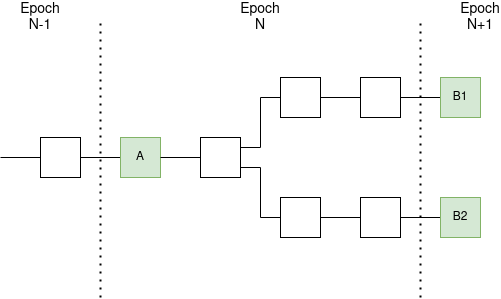

イーサリアム 2.0 の PoS は、従来の PoS を改善し、vitalik が進めていた Casper FFG (Friendly Finality Gadget) を採用しています。
Casper FFG は、主にネットワーク上にブロックチェーンが分岐してしまった場合、どうやって１つだけの有効なブロックチェーンを選出するというところを解決しようとしています。

<!--truncate-->

## Casper FFG の詳細

引用元：https://github.com/ethereum/annotated-spec/blob/master/phase0/fork-choice.md

ビーコンチェーンは、エポックとスロットという時間単位があります。さらに
- １エポックは、32 スロットを含める
- １スロットは、12 秒と規定されている

上記前提で、Casper FFG の大まかの流れとしては、

- エポック毎に、最初のスロットは「チェックポイント」になります。
- アクティブなすべてのバリデーターは、チェックポイントに対して、投票を行う
- 投票の件数ではなく、投票するバリデーターの預り金の金額を合計し、2/3 の超えたら、チェックポイントが「正当化」となる
- １個前のチェックポイントは、前の同じ投票・集計処理で既に正当化になっていたので、このタイミングで「確定」となる
- 一度確定となるブロックは変更することはできません

このように、ブロックの最終確定性を導入することで、ロング・レンジ攻撃を防ぐことができます。

## 極端ケースの対策
上記流れでは、投票が 2/3 を超える必要があるとなっていますが、極端のケースの場合、何かしらの原因で 1/3 以上のバリデーターの投票を収集できなかった可能性があります。
この場合は、Casper FFG に「inactivity leak」という仕組みを設けています。

- 1/3 以上のバリデーターの投票を収集できず、 4 エポック経過しても確定できなかった場合、「inactivity leak」処理が実行されます
- この処理は、正しく投票できている預り金の比率が 2/3 になるまで、収集できなかったバリデーターの預り金を少しずつ減らしていきます

こうすることで、このケースによる確定できないことを対応しています。

## まとめ
PoS は PoW よりエネルギーを大幅減らせた一方、新しいブロックを生成する難易度もそれに応じて変わっています。
よって、チェーン全体のセキュリティを担保する必要があります。
