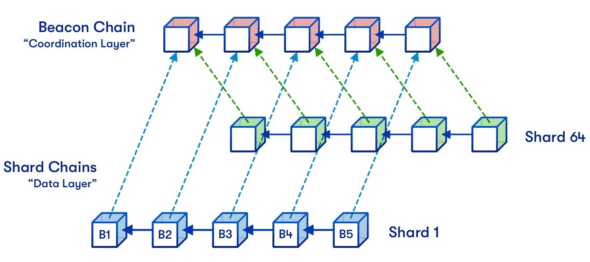
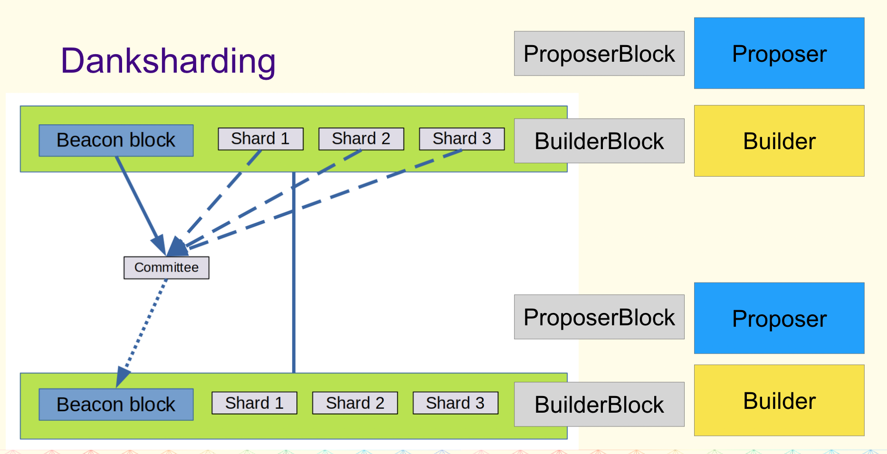

イーサリアム 2.0 のコンセンサスアルゴリズムが PoS に移行できました。次の課題はシャーディングになります。
- 2018 年頃スタートしてから研究し始めて、だんだん「ビーコンチェーン＋シャードチェーン」の設計でした。
- 2021 年末ごろ、rollup を基づいて新しい設計の記事 [New sharding design with tight beacon and shard block integration](https://notes.ethereum.org/@dankrad/new_sharding) が公開されました

それ以来、新しい設計がコミュニティで広く議論され danksharding と名付けました。

<!--truncate-->

## もとの設計の課題

引用元：https://vitalik.ca/general/2021/04/07/sharding.html

元の設計案では、シャードチェーンにあるノードサーバーは、そのシャードチェーンのデータだけ同期・処理します。課題はコンセンサスに参加するバリデーターのデータ同期です。
設計上は、コンセンサスに参加するバリデーターは、エポック毎に、バリデーターがランダムで委員会を編成し、その委員会がシャードチェーンに割り振られれます。このエポック内では、そのシャードチェーンのデータを処理します。
となると、バリデーターはほぼエポック毎にシャードチェーンを切り替える必要があり、新しいシャードチェーンのデータを同期する必要があります。これは結構広い範囲のデータ同期になり、相当複雑な内容になります。
規定の時間内ですべてのバリデーターが全部正常にデータ同期できる保証が難しいです。いくつソリューションがありますが、攻撃の対応も必要なので、全体的には難航な状況でした。

## danksharding 設計

引用元：https://docs.google.com/presentation/d/1-pe9TMF1ld185GL-5HSWMAsaZLbEqgfU1sYsHGdD0Vw/edit#slide=id.g1150d91b32e_0_800

シャードチェーンを使わずに、ビーコンチェーンにデータを付加する提案になります。
- 付加データは、今までのブロックデータ・ステートデータのように永久保持するのではなく、保持期間が設けられています。期間をすぎると、期限切れのデータを削除することが許されます
- データが多くなると検証などの処理も合わせて重くなりますが、数学的に、データの一部を検証するだけで確率的に大きいデータの可用性を証明できます。この辺は Reed-Solomon（Erasure Coding の実装であり、データを分割し冗長化する技術）と、KZG Commitment で保証されます。これは「DAS：Data Availability Sampling」という概念
- といっても、やはり処理が重くなるため、ブロックチェーンのノードサーバーの中央集権がもっと酷くなると思われるため、ブロック生成過程の中、ブロック提案者とブロック作成者を分けて、ブロック作成者の中央集権化は避けられないが、ブロック提案者がサーバースペックの要求がそれほど高くないため、分散化されることが期待できます。これは「PBS：Proposer-builder Separation」になります。大まかな流れとしては、
    - ブロック作成者は、ブロックヘッダーと手数料を提出する
    - ブロック提案者は、優勝ブロックヘッダーとブロック作成者を選択し、手数料をもらう
    - バリデーター委員会は、優勝ブロックヘッダーを検証する
    - ブロック作成者は、優勝ブロックのボディーを公開する
    - バリデーター委員会は、優勝ブロックボディーを検証する
- PBS があっても、ブロック作成者が意図的にある有効なトランザクションを無視することができます。これを解決するため設計したのは「crList：Censorship Resistance List」です
    - ブロック提案者は、crList を公開する
    - ブロック作成者は、ブロックヘッダーを提出する際に、自分が crList をみたことを証明し、crList にあるトランザクションを全部ブロックに含めなければなりません

詳細はまだこれから決めるので、細かい実装はまだはっきりになっていません。

## まとめ
Danksharding は今までの「シャーディング」と全く変わった設計なので、「シャーディング」とは言えるかどうかも疑問になりますね。
