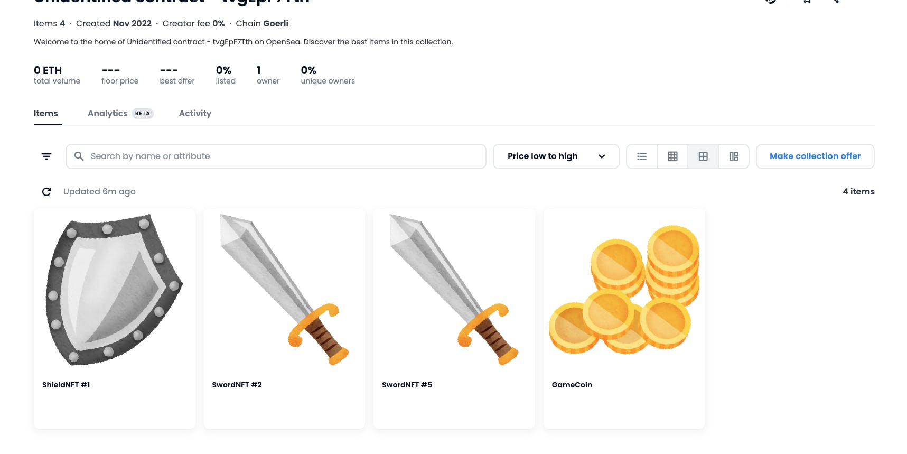
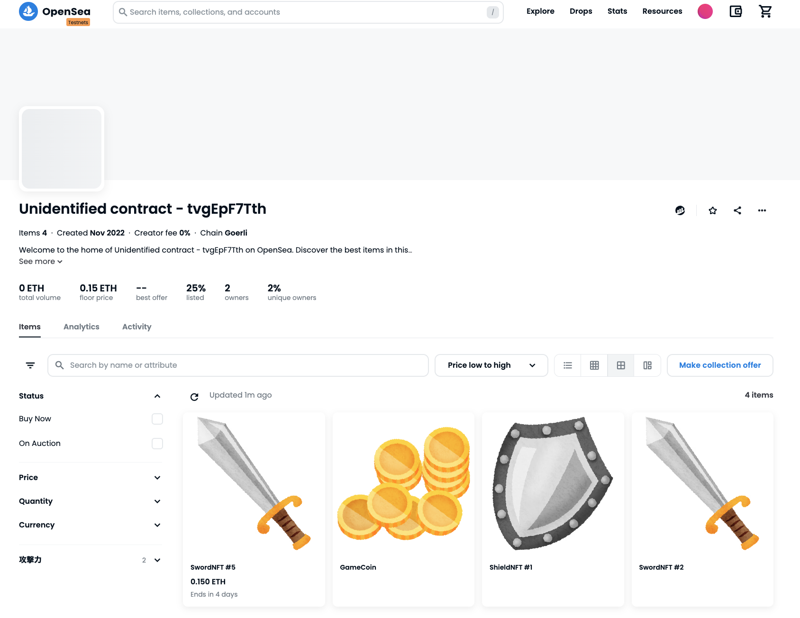
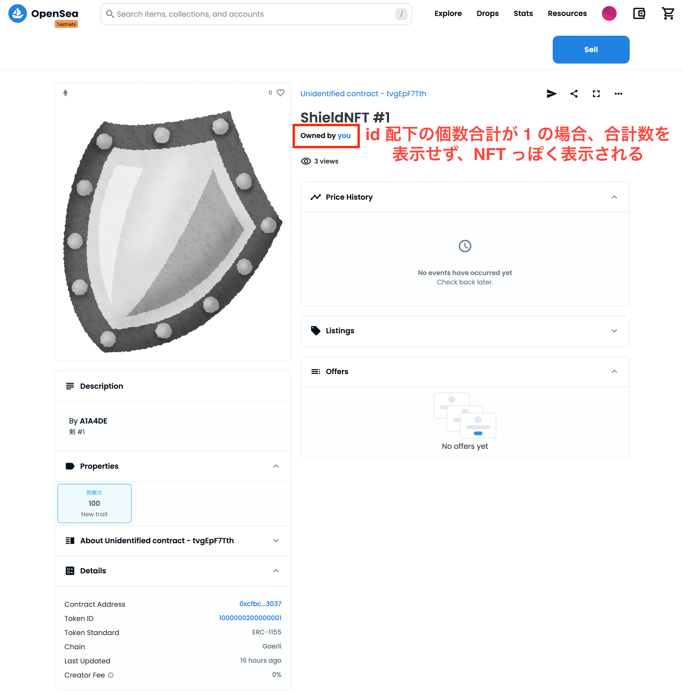
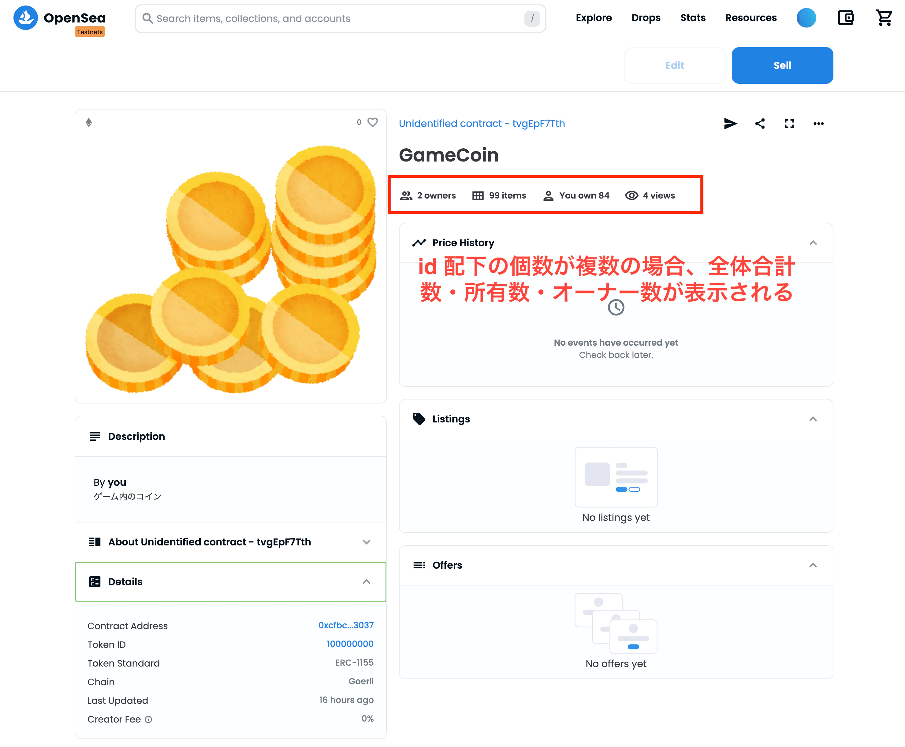
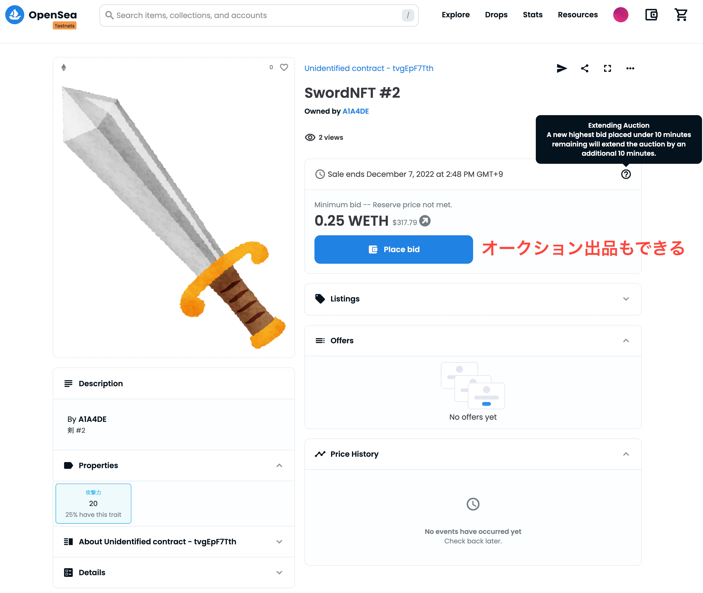
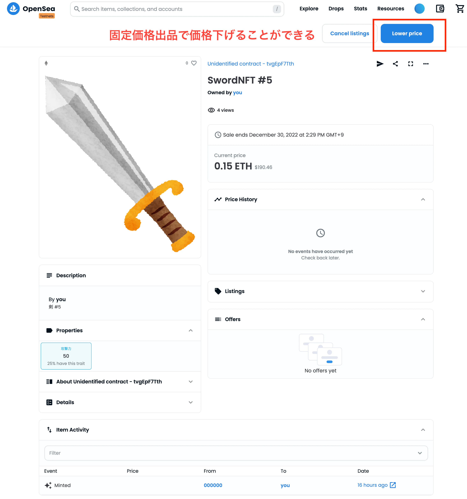

[前の記事](/blog/2022/12/26/erc1155-try) で ERC 1155 のマルチトークンの扱い方が分かったが、opensea でどう表示され、相性はどうなっているかを調査してみました。


<!--truncate-->

## デプロイした内容
## 画像ファイル・metadata ファイル
この辺は、pinata を使って ipfs にアップロードしておきました

- [コイン画像](https://gateway.pinata.cloud/ipfs/QmcmUyEBmLVkujpJzwXct1nr1ScCpZ2aKsG7BsnhyuYR4d)
- [剣画像](https://gateway.pinata.cloud/ipfs/QmfKHhY73qS3SbUxL2cGKYS6WuzaWYaWwxA6hPfnZ38QrD)
- [盾画像](https://gateway.pinata.cloud/ipfs/QmVSaKN9juTWVdApUwT8ArqMnF9uK2nL5NLbBqddggNR7R)
- [metadata ファイル](https://gateway.pinata.cloud/ipfs/QmNYCwzyM4FUaRpEypyqsFPA8j7jmh6aH2Nc8RBq5BsihX/)

## コントラクト内容

```solidity
// SPDX-License-Identifier: MIT
pragma solidity ^0.8.9;

import "@openzeppelin/contracts@4.8.0/token/ERC1155/ERC1155.sol";
import "@openzeppelin/contracts@4.8.0/access/Ownable.sol";
import "@openzeppelin/contracts@4.8.0/utils/Strings.sol";

contract FishToken is ERC1155, Ownable {
    constructor()
        ERC1155("https://gateway.pinata.cloud/ipfs/QmNYCwzyM4FUaRpEypyqsFPA8j7jmh6aH2Nc8RBq5BsihX/{id}.json")
    {
        _mint(msg.sender, 100000000, 99, ""); // 0000000100000000 は先頭の 0 が許されない
        _mint(msg.sender, じょう, 1, "");
        _mint(msg.sender, 1000000100000005, 1, "");
        _mint(msg.sender, 1000000200000001, 1, "");
    }

    function uri(uint256 _tokenId) override public pure returns (string memory) {
        return string(
            abi.encodePacked(
                "https://gateway.pinata.cloud/ipfs/QmNYCwzyM4FUaRpEypyqsFPA8j7jmh6aH2Nc8RBq5BsihX/",
                Strings.toString(_tokenId),
                ".json"
            )
        );
    }
}
```

## 補足
- openzeppelin の ERC 1155 コントラクトのままで、初期化処理にてテスト用データを mint するだけの内容です
- ERC1155 の初期化パラメータにわたす URL に {id} 文字列を含めています
    - これは EIP 1155 Metadata に書いている内容に従う実装です
- 上記と似ている役割を持っている関数 uri も定義していますが、これは opensea に metadata url を正しく識別させるためです

## デプロイ結果

https://testnets.opensea.io/collection/unidentified-contract-tvgepf7tth



opensea 上の表示は、

- ERC 1155 コントラクトは、ERC 721 と同じく、１つのコレクションとして表示される
    - なので、コントラクトの中で、id のルールに従って更にセクションを分けるのは、対応されていません
    - 上記デプロイした内容の中、下記２つのトークンは10000001配下の #2 と #5 ということは認識されません

    ```
    1000000100000002
    1000000100000005
    ```
- metadata も ERC 721 と同じルールに従えば、正常に表示される
- NFT / FT の区別については、前の記事に書いたどおりに、コントラクトの id ルールの設計次第なので、opensea はそのルールを知らないため、サポートできるわけがないと思いましたが、意外にそれっぽく表示されています。
    - 該当 token id 配下の残高合計（全オーナー）が 1 個の場合、NFTっぽいような表示になっています
    - 該当 token id 配下の残高合計（全オーナー）が 2 個以上の場合、残高合計数・ログインしているユーザ所有している個数・オーナー個数のデータが表示されます





## 注意点
- 現時点（2022 年 12 月）testnet でやってみた限りでは、オークションに出品できて、固定価格の出品でも価格を下げることができましたが、opensea のヘルプセンターに、ERC 1155 は、[opensea 上のオークションに出品できない、かつ、固定価格の場合価格を下げることができない](https://support.opensea.io/hc/en-us/articles/360063450733) のような記載があります。

> There are a few things to know when interacting with ERC-721 and ERC-1155 NFTs.
On OpenSea, ERC-1155 NFTs can't be listed on auction.
You can only lower a listing price on ERC-721 NFTs, not ERC-1155 NFTs.
Some wallets, like MetaMask mobile, have issues displaying ERC1155's in-app.

https://support.opensea.io/hc/en-us/articles/360063450733





## まとめ
ERC 1155 は opensea 上で出品・売買・送金できるようにみえます。

ただ、コントラクト全体が１つのコレクションとして扱われるため、id のルールによるサブコレクションのような扱い方は、サービス提供者側がサービス内で対応できますが、その範囲を超えると、意味がなくなります

さらに、ERC 1155 に対してウォレット・アプリのサポートもいまいちなので、特別な理由がない限りでは、ERC 721 を使うほうが無難だと思います。
