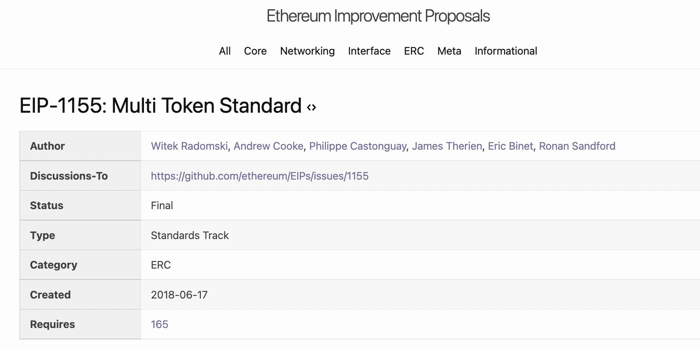

複数トークン規格と言われている ERC 1155 ですが、下記部分はモヤっていたので調べてみました。

- マルチトークンの扱い方
- NFT と FT はどう区別されるか


<!--truncate-->

## ERC 1155 の基本
規格詳細は下記 EIP ページ参照

https://eips.ethereum.org/EIPS/eip-1155

openzeppelin の実装はこちら

https://github.com/OpenZeppelin/openzeppelin-contracts/blob/master/contracts/token/ERC1155/ERC1155.sol

保持しているデータは下記 2 種類になっています。

```solidity
// Mapping from token ID to account balances
mapping(uint256 => mapping(address => uint256)) private _balances;

// Mapping from account to operator approvals
mapping(address => mapping(address => bool)) private _operatorApprovals;
```

- _balances の token ID の値は、コントラクトアドレス + ERC 721 の index のような役割になります
- トークンを表す際に、ERC 20 の場合、コントラクトアドレスのみでしたが、ERC 721 の場合は、コントラクトアドレスと index の２階層になっています
- なので、ERC 1155 はマルチトークンをサポートするなら少なくとも２階層の構造が必要ですが、その２階層をこの１つの id で表すように設けられています
- 例をあげましょう
    - アカウントA 0xa…1 が下記のようにトークンを持っているとします。
        - GameToken ERC20：99 枚
        - SwordNFT ERC721 #2
        - SwordNFT ERC721 #5
        - ShieldNFT ERC721 #1
    - これらのトークンが全部 ERC 1155 で管理しているなら、各 id の値は下記の形で表すことができます

        ```json
        {
          "0000000100000000": { "0xa...1": 99 },
          "1000000100000002": { "0xa...1": 1 },
          "1000000100000005": { "0xa...1": 1 },
          "1000000200000001": { "0xa...1": 1 },
        }
        ```
    - つまり、256 ビットの id を分割して
        - 前半の 128 ビット（16 進数の場合 8 桁）で トークン の id を表す
        - 後半の 128 ビット（16 進数の場合 8 桁）で index を表す
        - ERC20 タイプの場合 index 使わないため、全部 0 を指定しています
- ただ、ややこしいのは、このやり方は、EIP 1155 規約の最後の `Usage` 節に例として記載され、 The standard does NOT mandate how an implementation must do this. となって、必須の実装ではありません

## 調査結果
1. マルチトークンの扱い方 については、上記通りでした
2. NFT と FT はどう区別されるか は、意外な結果ですが、EIP 1155 標準のインファフェースでは、区別できません

## ERC 20 / ERC 721 と異なる部分
- ownerOf 関数がない
    - ERC 721 に _owners mapping があるので上記関数で調べられますが、ERC 1155 の場合そもそもこの mapping がないし、関数もありません
- name / symbol もない
    - EIP 1155 の Metadata Choices節にかかれてありますが、意図的にこの２つの関数を削除したようです
    - symbol は通貨取引以外であんまり使われてないので、一般的に有用なデータではない、かつ、衝突の可能性があるため、削除されました
    - nameは、メタデータで表せばよいので、重複を減らすため削除されました
        - また、メタデータにすることで、ローカライズも可能になります
- mint と転送系のメソッド（safeTransferFrom / safeBatchTransferFrom) に _data というパラメータがあります
    - このパラメータは、コントラクトの処理中には使われていません
    - EIP には 転送するために送信者によって提供された情報を変更せずに受信者にそのまま転送するように実装する必要がありますと書かれてあります
    - よって、コントラクトの動作確認などの場合は、その値を無視して問題ございません
    - ちなみに、remix などで動作確認する場合は、0x0を入力すればチェックを通れます
- ERC 1155 コントラクトで定義しているトークンであれば、複数の転送を一括で１つのトランザクションで処理できます
    - 上の例では、SwordNFT#2とShieldNFT#1 とアカウトBに転送したい、その２つの NFT は ERC 721 である場合、２つの NFT コントラクトの転送関数を別々呼び出して２つのトランザクションになりますが、ERC 1155 で定義されている場合、下記のように一括転送関数を１回の呼び出しで完結します
    ```js
    safeBatchTransferFrom(
      '0xa...1', // from
      '0xb...2', // to
      [1000000100000002, 1000000200000001], // token ids
      [1,1], // token amount
      "" // オプションデータ
    )
    ```
    - これこそが複数トークンを扱う一番のメリットじゃないかと思われますね

## まとめ
ERC 1155 １つのコントラクトで複数のトークンを扱うことは確かにできますが、インタフェースは、ERC 20 と ERC 721 と異なっているため、互換性はないようにみえます。

特に、FT / NFT を１つのコントラクトで管理できるのに、区別するインタフェースが設けられていないのは意外でした。

また、１つの idで複数トークンを表現するのは、gas 節約する目的があるのは理解できていますが、ルールが決められていないところも結構意外でした。結局このルールは、コントラクトを実装する際だけではなく、コントラクトを利用する側もそのルールを把握して使う必要があるので、若干使いにくいと感じられますね。
